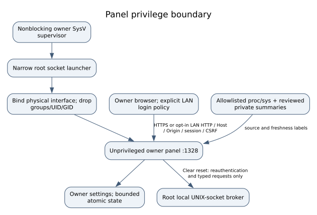

# Form 3 Owner Root

**Repair, preservation and local maintenance for the Formlabs Form 3.**

This project documents a route from a protected storage backup to local root,
secure SSH and an independent maintenance panel. It includes the source, commands
and recovery steps needed to understand the changes instead of treating them as
a black box. Hardware work is intended for technically experienced users.

I started it to repair my Form 3 when the manufacturer's repair route was no
longer available to me. Encrypted
support archives made independent diagnosis difficult. I obtained local root
access, preserved the storage and built a maintenance panel around that work.
Some local diagnostics are plaintext; root access does not decrypt every support
archive or establish that the original fault is repaired.

I share authored scripts, panel source, reviewed transformation recipes,
instructions, original illustrations and checksums. **No original or modified
manufacturer firmware, private keys, device records or complete rootfs is included.**
You provide compatible inputs through your own authorized acquisition. This is
an advanced-user project with explicit hardware and compatibility gates, not a
universal one-click unlock.

## From private research to a source release

This project began as a private repair and research repository. This edition is a
selected source release prepared from that work, with a new history rather than
the original research archive. Private data, manufacturer binaries and material
with unresolved copyright, confidentiality or other redistribution questions have
been left out. Some research details may therefore be absent. Those exclusions
are not a guarantee of legal clearance or universal hardware compatibility.

The visibility change is a separate maintainer decision; preparing this edition
does not publish it automatically. The [release checklist](docs/public/RELEASE_CHECKLIST.md)
explains the final checks and what is deliberately excluded.

## Follow one path

| Task | Guide |
|---|---|
| Follow the commands in order, from my own backup to root SSH | [Command walkthrough and exact change map](docs/public/COMMAND_WALKTHROUGH.md) |
| Build and test the source without a printer | [Build, dependencies and test scope](docs/public/BUILD.md) |
| Understand the chip clip and Pi 5 wiring before touching hardware | [Pin orientation, connection table and meter checks](docs/public/PI5_CLIP_GUIDE.md) |
| Understand root, electrical checks, acquisition and recovery | [Root and acquisition guide](docs/public/ROOT_GUIDE.md) |
| Install separate owner SSH/SFTP and the panel | [First installation, daily use, updates and rollback](docs/public/OWNER_INSTALL.md) |
| Enroll secure root SSH and use it daily without repeated passwords | [Host trust, strict profile, SSH agent and SFTP acceptance](docs/public/SECURE_SSH.md) |
| Review a saved print attempt and heater/fan history | [Offline private log review](docs/public/LOG_REVIEW.md) |
| Build the native Idle clock and original boot/panel logo | [Display transformation recipes](docs/public/NATIVE_DISPLAY.md) |
| Understand the publication boundary and credits | [Rights, provenance and release checks](docs/public/RIGHTS_AND_RELEASE.md) |
| Check what is proved and what remains open | [Compatibility and coverage](docs/public/LIMITS.md) |

## What the code provides

- A pinned static ARMv7 RAM rescue build using the genuine kernel and DTB.
- Read/CRC checks and a reference-specific QSPI image builder; no universal flash writer.
- Separate owner SSH/SFTP on **2222**, with owner-generated keys and retained host trust.
- An unprivileged maintenance panel on **1328**, current-interface address handling,
  HTTPS and explicitly selected private-LAN HTTP, bounded APIs and diagnostic exports.
- Typed owner preferences and a refill notebook; original lifetime counters remain separate.
- Local touchscreen date/time and original project artwork built from your own pinned input.
- Signed source packages, exact transaction plans, backups, verification and rollback.

*Architecture diagram: the panel has bounded read adapters; it is not a generic
root-command or actuator proxy. Source and proof labels are in the guides.*

Unknown data is **UNAVAILABLE**. Recorded data is **HISTORICAL/CACHED**, not live.
Native refill/reset, license issuance, automatic vendor privacy changes and panel
power controls remain disabled. No thermal, laser, motion, lid, overflow or watchdog
protection is removed. A stock software-only first-root route remains unproved.

## Why the demonstrated route works

The inspected U-Boot can load the printer's genuine kernel/DTB together with a small
external rescue from verified free QSPI space. An intentionally changed environment
selects that rescue while preserving SPL/U-Boot executable bytes. Rescue provides
initial root and backups. A separate p6/p7 file transaction then installs owner
services. Restoring **the same printer's own original QSPI** returns to normal vendor
boot with those services alongside it. An existing vendor public key is not owner
authorization. Another printer's dump or identity is never an installation input.

The checked-in rescue profile is tied to one authenticated reference acquisition.
A different factory hash requires the [profile review procedure](docs/public/ROOT_GUIDE.md),
not a removed safety check. The photos available during research did not resolve
all electrical details. The wiring guide separates the recorded connection table
from the still-required identification and electrical measurements for an actual setup.

## Credit and license

I thank **Łukasz Jakóbiec** for documenting the work that helped me access my system:
[wemakerobots part 1](https://wemakerobots.com/en/projects/debricking-form-3-part-1/)
and [part 2](https://wemakerobots.com/en/projects/debricking-form-3-part-2/).
Those articles cover a Form 3+ with a different fault and procedure; no endorsement
is implied. I used a clip on the still-soldered flash after removing the SOM,
without soldering UART or removing the chip. That is still hardware intervention.

[MIT](LICENSE) applies to my authored contribution, with earlier contributor notices
retained. [Third-party notices](docs/public/RIGHTS_AND_RELEASE.md) separately cover
BusyBox patches, dependencies and the wordmark. Product names identify compatibility.
Neither source-only packaging nor a checksum establishes legal permission.

Maintained by **Mathias Zimmermann**. This project is not affiliated with or
endorsed by Formlabs.
