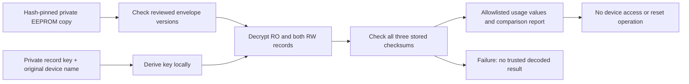

# Decode a private cartridge backup, without writing a cartridge

This laptop-only decoder makes a copied consumable record inspectable. It does
not turn an empty cartridge into a physically full supply, remove a material
mismatch, authorize dispensing or establish safe restoration. No manufacturer
key, device identity or captured EEPROM is distributed with the source.

## Supported evidence and limits

The reviewed layout is a **128-byte C/RO-version-0 cartridge with RW-version-1
records at offsets 64 and 96**, on Form 3 firmware 2.5.6-2773. Do not apply this
layout to tanks, other memory sizes, other model families or unknown versions.
The reference `/usr/bin/TankCartridgeDaemon` SHA256 is
`a2a5e3c47cf1c0c2cc627bcfcba10c0c20a843420fa46ca39290be27e861a8c1`.
Addresses below are ELF virtual addresses; the older private Ghidra project adds
`0x10000`. The decoder does not execute that binary.

**CODE / ISOLATED FUNCTION TEST:** the recovered read path is:

| Step | Evidence | Implemented interpretation |
|---|---|---|
| Derive a block key | `getCryptKey`, `0x1db9f8`; transform call `0x1dbae4`; charmap descriptor `0x8706b8` | Concatenate the private key-map entry and original device name; ISO 8859-1 bytes; SHA256; lowercase hexadecimal; every fourth hexadecimal character gives 16 ASCII bytes |
| Block cipher | `initCipher`, `0x1db458`; `encryptBlock`, `0x1daf98` | XTEA, 32 rounds, little-endian 32-bit words |
| Stream operation | `cryptOFB`, `0x1dbd04` | OFB; IV is the four-byte RO IV-half repeated twice; RO skips ten stream bytes, RW/1 skips zero |
| Error check | inline loop in `DecryptConsumableBytes`, `0x1db784`; comparison `0x1db8a0` | Two byte-wise sums modulo **65536**, combined as `sum1 | (sum2 << 16)`; stored little-endian |
| Usage decoding | RW type selected by `RWToBytes`, `0x48f678`; `GetDispenseCount`, `0x48ee40` | First three bytes are a **big-endian** 24-bit count; next uint32 and two uint16 fields are little-endian |

This is not conventional modulo-65535 Fletcher arithmetic. The first three bytes
are an array, so the surrounding `encoding/binary` little-endian setting does not
determine their numeric interpretation. Those two distinctions explain why the
earlier limited checksum guesses were insufficient.

The checksum is **not a signature, a MAC, manufacturer authentication or proof of
physical resin volume**. Padding and unused bytes are not covered by these three
record checks. The independently retained full-image SHA256 binds the entire copy.



*All inputs are local copies. The output contains usage projections, not keys or
identity fields. Passing the error checks is independent of writing readiness.*

## Run it

Prerequisites: the [developer setup](BUILD.md), your own saved EEPROM image, its
matching private JSON mirror, and the original recorded 1-Wire name in a private
text file. The JSON contains `SecretKey`; never paste it into a terminal command,
ticket or repository. The device-name file is also private. Obtain input hashes
from retained acquisition/copy receipts; do not substitute another cartridge's
name or derive trust from an untrusted download.

```sh
# LAPTOP — run from the source root; no printer connection or vendor execution.
: "${EEPROM_COPY:?private 128-byte acquired copy}"
: "${EEPROM_SHA256:?independently retained acquisition hash}"
: "${RECORD_COPY:?matching private cartridge JSON copy}"
: "${RECORD_SHA256:?independently retained record hash}"
: "${DEVICE_NAME_FILE:?private file containing the original recorded device name}"
: "${DEVICE_NAME_SHA256:?independently retained name-file hash}"
: "${PRIVATE_REVIEW:?existing private output directory}"
umask 077
python3 tools/decode_cartridge_memory.py "$EEPROM_COPY" \
  --sha256 "$EEPROM_SHA256" \
  --record-file "$RECORD_COPY" --record-sha256 "$RECORD_SHA256" \
  --device-name-file "$DEVICE_NAME_FILE" --device-name-sha256 "$DEVICE_NAME_SHA256" \
  --output "$PRIVATE_REVIEW/decoded-cartridge.json"
```

Expected: a new mode-0600 JSON report and a short checksum/comparison summary.
No existing output is overwritten. Symlink input paths, device inputs, wrong
hashes, unknown versions and failed checksums are refused. Only the four usage
fields are projected. Unknown JSON field names are not echoed because field names
can themselves contain secrets. A mismatch with the JSON mirror is reported; it
is not silently reconciled or written back. A failed copy prevents any decoded
report, rather than selecting a supposedly newer copy without a proven rule.

## Test coverage and what it proves

The standalone fixtures in `tests/test_cartridge_decode.py` use an explicitly
synthetic key and identity. They cover a known block/KDF vector, checksum overflow,
all occupied-byte single-bit corruptions, wrong keys/identities, truncation,
versions, redaction, input pins, symlinks, device rejection and non-overwriting
private output. Run the normal [offline test path](BUILD.md); no vendor input is
needed for those fixtures.

Separately, 50 comparisons were performed against selected functions/instructions
from the pinned ARM binary in Unicorn 2.1.4, inside an unprivileged disposable
user/PID/network namespace with no host home or credentials and a read-only binary:

- one KDF fixture (allocation, SHA256 and selected Latin-1 transformation modeled;
  the vendor concatenation/selection control flow executed);
- one block-cipher fixture and six native OFB fixtures, with Go allocation/copy
  hooks, including 11-byte RW and 33-byte RO input with the different stream skip;
- 34 native checksum-loop comparisons for lengths 0–33, including overflow;
- eight native packed-counter comparisons, including 255/256 and the 24-bit limit.

These are selected-function checks, **not** full-daemon, hardware, power-loss or
write tests. An actual privately acquired image additionally passed all three
checksums and its four decoded usage fields matched the separately saved JSON
mirror. That establishes one observed format/key/context combination, not every
cartridge release or a manufacturer signature. Raw plaintext, keys and emulator
working files remain private.

## Stop conditions before any later modification

No native write backend or replacement-image command is supplied. Still required:
complete selector/write-count semantics, writer exclusion, RAM/disk/chip merge and
power-loss recovery, actual protection state, and an independently reviewed
restoration procedure. Material compatibility and filling-system health remain
separate conditions. Retain original copies even if decoding fails; do not repair
or overwrite them. The [envelope inspection guide](CARTRIDGE_INSPECTION.md) remains
useful without access to any secret.

## Next investigation: copy selection and mirrors

See [Cartridge reconciliation](CARTRIDGE_RECONCILIATION.md) for the subsequent
selected native load/merge tests and the synthetic offline model. Successful
decoding alone does not establish how conflicting persistent states reconcile
or make a native reset ready.
