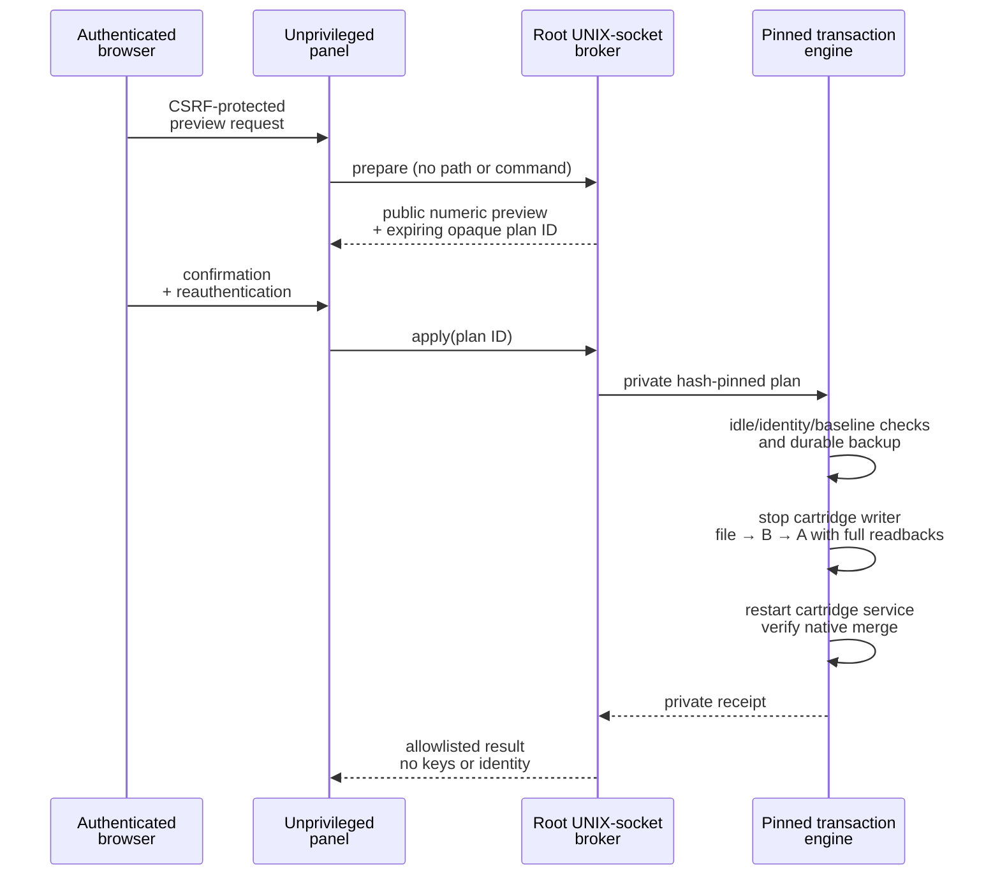

# Clear cartridge usage adjustment in the panel

## Scope and prerequisites

Version **0.5.13-review** adds an explicit electronic usage adjustment under
**Materials → Clear cartridge usage reset**. It initially supports only legacy
**FLGPCL02 / 1000 mL**, C/0 main memory with RW version 1, on Form 3 p6 firmware
**2.5.6-2773** with the pinned cartridge daemon, Sauron and service scripts.
Other materials, unknown formats, changed binaries, inconsistent copies or a
non-idle printer are refused. This is not an unrestricted consumable editor.

The estimated remaining quantity is accounting, **not a physical level sensor**.
Resetting it does not add resin, validate chemical compatibility, repair dispensing
hardware or grant printing permission. No identity, material, RO data, date, key,
license, actuator configuration or manufacturer firmware is changed.

## Use

1. Finish or cancel the current job using the ordinary printer controls. Keep the
   cartridge installed and leave the printer idle. Do not queue/start a job,
   change cartridges or disconnect power during this operation.
2. Open Materials and select **Review cartridge reset**.
3. Select **Prepare a fresh preview** and authenticate with the existing panel
   secret. This is required even when ordinary WLAN viewing permits anonymous
   sessions. On unencrypted WLAN HTTP the credential is not protected in transit;
   the enrolled isolated HTTPS path remains available.
4. Wait for the bounded-input read-only inspection. On the reference ARM system it
   took about 31 seconds, primarily to hash the actual firmware components twice.
   The panel remains responsive while the worker runs.
5. Check the identified material, nominal capacity and before/after usage. If the
   result is **ALREADY FRESH**, no EEPROM write or cartridge service restart occurs.
6. For a **READY** preview, type `RESET CLEAR USAGE`, re-enter the panel secret and
   select **Reset electronic usage**. A preview expires after five minutes.
7. Wait for **COMPLETE** and the readback/reload results. Closing the browser does
   not cancel a started transaction. **RECOVERY REQUIRED** locks further resets;
   preserve the private backup and inspect the failed stage over owner SSH.

There is no automatic reset at insertion, startup or a volume threshold. A later
explicit adjustment is possible only when fresh checks pass. Repeated clicks on
an already-zero state do not consume another EEPROM write cycle.

## Privilege and transaction boundary

The root broker has no network listener. The fixed local socket verifies kernel
peer credentials; only root and the enrolled panel UID may connect. The panel
also checks the broker is root-owned. Requests accept only `status`, `prepare`,
and `apply` with a matching preview ID. There is no arbitrary path, shell command,
D-Bus proxy, material selector or raw-byte input. Authentication, Host/Origin,
CSRF, expiry and request bounds remain enforced; reauthentication attempts are
rate limited. Bearer read access cannot mutate the cartridge.

The daemon is excluded before writes. The order is persistent file, B at offset
96, A at offset 64. Each copy is exactly 16 bytes. Full-image readback checks also
verify the other 96 bytes remain unchanged. The original Clear secret derives
its own record; no other cartridge image is used. The write counter increments
once; the three usage fields become zero. Post-reload checks sample after
2, 3, 5 and 10 seconds. They establish an observed merge result, not immunity to
every future vendor-state change or automatic actuator action.

The helper shares the owner installer transaction lock and holds its own lock.
An owner update cannot interleave with its writes. Shutdown requests stop new
broker work but do not SIGKILL an active transaction. Process failure, power loss,
or post-reload disagreement is a recovery case, never an automatic retry.

## Private records and recovery

Raw backups stay in root-only `/data/form3-clear-reset-<UTC>-<random>/`.
Plans and sanitized summaries are retained under
`/data/owner-maintenance/cartridge-reset/`; they are not panel-download endpoints.
The plan contains device-derived secrets and must never be published. The broker
refuses more work at its file-retention limit rather than deleting backups.

On a caught write/readback failure, the transaction attempts to restore touched
copies A then B and finally the original file, with complete readback. A failed
rollback is not reported as success. After a process/power interruption the durable
`in-progress.json` marker blocks subsequent requests. Do not remove it merely to
retry: first compare the saved baseline, intended image, current image, file and
receipt; exclude concurrent native writes before any recovery. No claim is made
that a power interruption is automatically recoverable.

To disable new reset work independently of ordinary panel use, create the
root-owned `/data/owner-maintenance/cartridge-reset.disabled` marker and perform
a reviewed owner-supervisor restart **when no transaction is active**. Remove
that marker and restart the supervisor to enable it again. These are owner-service
operations; a printer reboot, vendor startup change or flash write is unnecessary.

## Installation and version compatibility

This feature requires a separately signed **maintenance** package, because the
root broker and codec are outside the panel release. A panel-only archive cannot
install them. Use the existing independent production signer pin and ownerctl
maintenance plan/apply/verify path. Preserve the existing primary and secondary
network policies and owner SSH identity. The only p6 file changed is the existing
owner SysV hook; helper/release files and transaction records are on p7.

The old verifier intentionally rejects newly added package paths. The transition
uses a hash-reviewed copy of the new authored ownerctl/verifier in RAM, retains
verification of legacy packages, then authenticates the extended maintenance
package against the already installed signer pin. Never weaken the old verifier
or treat a package-supplied key as authority. Signed extensions must be complete.
Rollback uses the saved ownerctl transaction and restores the prior hook, bootstrap,
release selection and policy. Private consumable backups are not erased by rollback.

## Evidence and tests

* **CODE:** [codec](../../owner-maintenance/cartridge_codec.py),
  [transaction](../../owner-maintenance/cartridge_transaction.py),
  [broker](../../owner-maintenance/cartridge_broker.py),
  [panel client](../../owner-ui/reset_client.py).
* **OFFLINE TEST:** synthetic codec corruption/roundtrip, write ordering,
  interruption/readback/rollback, stale baseline, plan expiry/replay/concurrency,
  retention, HTTP authentication/origin/CSRF and browser interaction tests.
  Synthetic secrets and targets are not device credentials or hardware results.
* **OWNER HARDWARE OBSERVATION:** the preceding explicit legacy Clear transaction
  changed estimated usage 1033.6 to 0 mL, count 284 to 0, cumulative time 4779 to 0,
  and WriteCount 538 to 539; both copies and the mirror survived daemon reload.
  The current feature's live acceptance deliberately uses read-only preview and
  the already-fresh no-write path; it does not repeat that physical write.
* **UNKNOWN:** general cartridge-family compatibility, physical resin quantity,
  manufacturer cloud reconciliation, universal actuator lockout and arbitrary
  future firmware behavior. This feature sends no cloud or actuator commands.

The protocol reconstruction and its exact binary/function references are in
[decoding](CARTRIDGE_DECODING.md), [reconciliation](CARTRIDGE_RECONCILIATION.md)
and [writeback](CARTRIDGE_WRITEBACK.md). Earlier reports that state writeback was
not executed describe their historical milestone, not this subsequent transaction.

### 2026-10-03 acceptance

The signed 0.5.13 maintenance update was installed and verified on the reference
printer. Direct WLAN HTTP login, status, CSRF rejection, logout and the real
already-fresh preview passed. The panel ran as UID 65000; the local broker ran as
root. The EEPROM hash remained unchanged and WriteCount remained 539. No further
cartridge write or printer reboot was performed for this feature acceptance.
WLAN owner SSH and the vendor Formule listener remained available. No primary
Ethernet IPv4 address was assigned at this check, so primary HTTPS was not tested
live; its policy and identity were preserved.

The source suite passed 601 fixtures, the selected source edition passed 467, and
39 synthetic tests passed under the genuine target Python 3.5.3. These are distinct
scopes, not 1,107 unique hardware tests. An isolated Firefox session exercised the
complete confirmation/apply/result flow against a synthetic broker. The actual
browser-to-device write path has not been retested on another consumed cartridge.
All 18 signed package member hashes match the canonical fixture-run source receipt.
See the [sanitized acceptance receipt](../../analysis/owner/cartridge-panel-0.5.13.json).

One superseded 0.5.5 panel release was transactionally archived to stay within the
eight-release bound; its files and original transactions were preserved. p6 was
briefly remounted writable for the existing owner hook and restored read-only
before restarting only the owner supervisor. Current/prior release and rollback
records remain available. No vendor service was stopped by this deployment.
