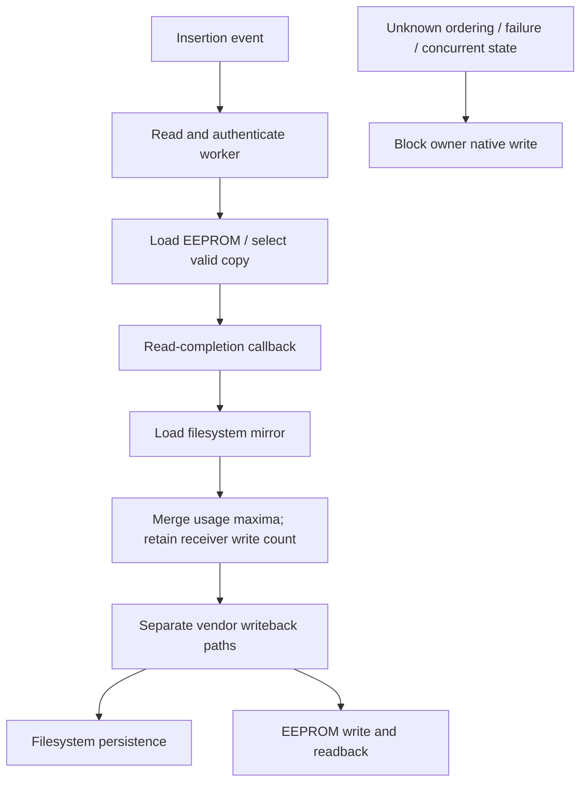

# Cartridge copy selection and usage reconciliation

> HISTORICAL RESULT: this report describes its named research tool and milestone.
> The later [panel write implementation and acceptance](CARTRIDGE_PANEL_RESET.md#evidence-and-tests)
> has a separate scope; see the [central evidence index](EVIDENCE_STATUS.md).

This investigation explains why changing one counter and restarting is not a
demonstrated refill transaction. The reusable tool is an **offline synthetic
model**, not a memory writer, reset utility or permission to dispense. Identity,
manufacture date, material pairing and protection mechanisms remain unchanged.

## Evidence and scope

Reference: copied p6 `/usr/bin/TankCartridgeDaemon`, firmware **2.5.6-2773**,
SHA256 `a2a5e3c47cf1c0c2cc627bcfcba10c0c20a843420fa46ca39290be27e861a8c1`.
All addresses below are **ELF virtual addresses**; the historical Ghidra project
uses these addresses plus `0x10000`. Conclusions apply to the selected single
Form 3 cartridge path, not all consumables or firmware releases.

**FILE/CODE + ISOLATED FUNCTION TEST:** selected ARM functions were executed with
Unicorn 2.1.4 inside an unprivileged, network-isolated bubblewrap environment.
Only the pinned executable and synthetic inputs were exposed. Allocation and
logging were modeled. The load-path fixtures additionally modeled successful
acquisition/authentication and controlled decoder results. Initialization and
write operations were intercepted, never performed. No full daemon, vendor init,
device bus, printer or manufacturer endpoint was executed/contacted.

The preceding [decoder investigation](CARTRIDGE_DECODING.md) independently checked
the actual copied image. Its result must not be confused with the synthetic
selection tests here. Raw memory, private identifiers, key material and native
instruction listings are not distributed.

## What the selected functions establish

| Question | Result | Exact reference / proof limit |
|---|---|---|
| Does the larger write count select a valid copy? | A is preferred when both A and B validate, including either ordering of their write counts | `main.LoadFromEeprom` `0x4eabd8`; verification calls `0x4eb0b8`, `0x4eb184`; final A decode `0x4eb8e0`. Authentication/decoder results modeled |
| What if only B validates? | B is selected | Final B decode `0x4eb9c8`; native selection control flow executed |
| Does VerifyRW return a write count? | No: the traced method returns a validity boolean | Cartridge wrapper `0x4f4910`, value method `0x48fa40`; decoder `0x48f0c4` |
| Does lowering one usage mirror lower the merged state? | Volume, dispense count and cumulative time retain the higher values | `CartridgeRW.MergeWithRW` `0x48fbc0`, six native numeric fixtures |
| Is WriteCount also merged by maximum? | No: this function retains the receiver's WriteCount | Same function; equal-usage fixture with a larger incoming WriteCount confirms the distinction |
| Are filesystem mirrors consulted on insertion? | A reachable read-completion path loads the filesystem mirror and dispatches Merge | Static call chain below; complete scheduling and all identity branches remain unproved |
| Are damaged records treated like ordinary valid records? | No: separate initialization/error paths exist | Type 4 (`Cartridge`) load fixtures; neither path is implemented by the authored tool |

When incoming volume is larger, the traced native function updates its float64
volume and recomputes the 0.1-mL packed quantity by truncation. A synthetic 0.05-mL
increase retains 0.05 in memory but quantizes to zero. This is a representation
detail, not a recommendation to exploit rounding or a physical volume sensor.

If neither copy validates, a copy classified as uninitialized can lead to an
initialization dispatch at `0x4eb34c`. Otherwise the modeled type-4 path enters
`reinitializeRWPartition` (`0x4ea04c`) and returns an error. The initialization
implementation was **not executed**. The native blank predicate (`0x4ee408`)
recognizes all-zero/all-FF mixtures and, in isolation, accepts an empty or short
slice. This does not establish that the bus/caller permits truncated records.
The authored decoder requires exact lengths. Intentionally damaging records is
not a supported reset or recovery procedure.

## Insertion, mirrors and writeback



*Static reachability plus selected-function tests; this is not a complete boot
state machine or a tested all-store transaction.*

Reproduce the static trace with the pinned copy and the existing Go function
index/disassembler. Follow `onInserted` (`0x4e0d30`) to
`doReadAndAuthenticate` (`0x4e2a08`), whose worker (`0x4e2a74`) calls
`LoadFromEeprom` at `0x4e2ae4`. In `onReadAuthenticateComplete` (`0x4e1d5c`),
`loadFromFilesystem` (`0x4e8c08`) is called at `0x4e1dfc`; indirect consumable
Merge dispatches occur at `0x4e1e30` and `0x4e2374` through interface slot +68.
`(*cartridge).Merge` (`0x4e7ff8`) calls `MergeWithRW` at `0x4e8054`.
This makes insertion/read completion relevant; reboot is not the only potential
read trigger. Which receiver wins in every completion branch remains unresolved.

Previously traced `Flush` (`0x4ebeb8`), `flushToFilesystem` (`0x4e9410`) and
`writeRW` (`0x4edf8c`) are separate persistence stages. A readback comparison is
not proof of atomic update across both EEPROM copies, disk and RAM. This run
does not resolve writer exclusion, write-count increments, short writes,
power-loss recovery or restore reliability.

## Reproduce the authored model

Prerequisite: the [developer setup](BUILD.md). These commands use no device,
private key, vendor executable or original evidence.

```sh
# LAPTOP — synthetic, offline; use a NEW private output path.
: "${PRIVATE_REVIEW:?set an existing private output directory}"
python3 tools/model_cartridge_reconciliation.py --demo \
  --output "$PRIVATE_REVIEW/reconciliation-demo.json"
python3 -m unittest discover -s tests -p test_cartridge_reconciliation.py
```

Expected: `data_class: SYNTHETIC`, no authorized native writes, and 16 passing
unit tests. The tool refuses an existing output rather than overwriting it.
Tests cover maxima, receiver write-count retention, representable limits,
fractional volume, invalid/non-finite inputs, copy-selection failures and
exclusion of unrecognized fields (including secret-bearing dictionary keys).
The model assumes validity flags; it does not authenticate a cartridge.

Separately, six native merge fixtures, eleven native selection fixtures and
seven blank-predicate fixtures completed in isolation. These counts are not
hardware tests, power-cut tests or additional full-daemon acceptance cases.

## Practical conclusion and next gates

A refill notebook can record independently declared additions while preserving
native lifetime usage. A real native reconciliation mechanism still needs:

1. Complete receiver/mirror ordering and exclusion of concurrent vendor writers.
2. First/second-copy scheduling, counter increment and failure/restart behavior.
3. Exact chip protection state and a demonstrated, reversible restore procedure.
4. Correct resin/profile/tank pairing without relabeling one material as another.
5. Resolution of filling-related resets and a proven safe pre-actuation boundary.

Changing serial/date does not establish more resin or fix a material mismatch.
This model applies no privacy policy and proves no cloud synchronization claim.
Local-only operation requires independent network enforcement; renaming a
cartridge is not privacy enforcement. No printer change or panel deployment was
performed in this continuation.

## Writeback continuation

The subsequent [writeback failure investigation](CARTRIDGE_WRITEBACK.md) resolves
selected file/B/A ordering, retries and partial failure behavior. It narrows the
unknowns above but does not establish atomic restoration or authorize a reset.
