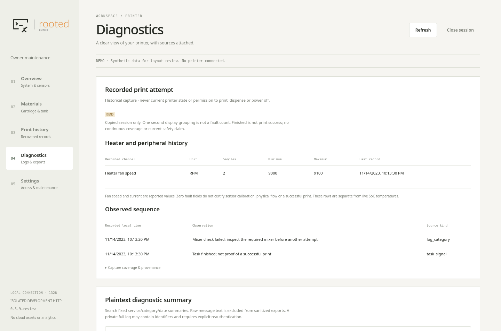

# Read a saved print attempt without contacting the printer

This optional workflow follows [secure SSH installation](SECURE_SSH.md), but the
analysis itself is fully offline. It needs explicitly acquired private JSONL
streams in the format written by `tools/record_print_session.py`; it is not an
arbitrary firmware-log parser. No log, model, device secret or real session is
distributed with this source. Synthetic tests work without printer evidence.

## Sources and limits

| Input | Useful output | Boundary |
|---|---|---|
| Captured text log chunks | Timestamped reviewed categories and byte provenance | Baseline history, repeated callers and actual fault episodes differ |
| `daguerreHeater_v1.csv` | Heater setpoint/current, fan RPM, named peripheral temperatures and fault fields | Historical samples, not current values or physical safety clearance |
| Passive D-Bus monitor bytes | Reviewed task/state/layer and temperature observations | Fragmented transport; unknown messages are omitted; no method is called |
| Proc/sysfs samples | Five named SoC temperatures | GPU temperature is not GPU load or resin temperature |
| Fluent Bit MessagePack views | Bounded decode/record coverage | Reconnection/rotation can repeat or truncate queue views |

The current decoder requires the captured identity for firmware 2.5.6-2773,
Linux 4.9.65+ and selected p6. An unsupported capture fails; do not change its
identity fields to make it pass. Exact byte/hash checks detect corruption, not
forged evidence. Save the original manifest independently before using copied data.

## LAPTOP: build a new private report and optional panel bundle

```sh
# LAPTOP — explicit saved files only; no network/printer access.
: "${STREAM_ONE:?absolute path to copied initial stream JSONL}"
: "${STREAM_TWO:?absolute path to copied continuation stream JSONL}"
: "${REVIEW_PRIVATE:?new directory below research-private}"
umask 077
mkdir -m 700 -- "$REVIEW_PRIVATE"
python3 tools/analyze_print_session.py \
  --stream "$STREAM_ONE" --stream "$STREAM_TWO" \
  --output "$REVIEW_PRIVATE/print-analysis.json" \
  --bundle-output "$REVIEW_PRIVATE/panel-bundle"
```

Repeat `--stream` for each actual continuation, in acquisition order. Supply just
one when there is no continuation; never invent or duplicate a file to fill the
example. Existing destinations, symlinks/FIFOs, corrupt chunk hashes, oversized or
truncated JSONL, conflicting text overlaps and unexpected firmware are rejected.
Missing file ranges are not joined across holes. Incomplete final D-Bus messages
are counted and omitted rather than guessed. No repair/replay is attempted.

Output remains private even though text/identifiers are projected out: timestamps
and source fingerprints can still identify a session. The full private report
records stream SHA256/record numbers, log offsets/line SHA256, coverage limits and
selected observations. The optional bundle contains `panel_snapshot.json`,
`print_session.json` and an empty `diagnostics.json`; it does **not** contain raw logs
or expand the existing private full-log export allowlist.

## Read it in the panel

The existing server `--bundle` option accepts the generated bundle. Use the isolated
development setup in [BUILD](BUILD.md), a new private owner state directory and a
local secret file, then select **Diagnostics → Recorded print attempt**. It is an
optional file provider: missing/invalid reports show unavailable and do not create
a network connection or install a collector. Host sample values are labeled DEMO;
actual imported records remain HISTORICAL. Never label a private real capture DEMO
just to publish a screenshot.

Each heater channel shows source unit, range, count and last record. The timeline
groups identical categories within one second for display; its count is not an
independent fault count. A task `finished` is not a successful-print verdict.
Code 85, filling-state 164 and reset-while-printing 293 have distinct explanations
in the pinned firmware reference. None of those reference entries asserts that
the error is happening now.



*Offline Firefox fixture, explicitly DEMO. The screenshot contains authored sample
values, not private printer logs or a current hardware reading.*

Loading this bundle into a deployed printer is a **separate reviewed operation**;
no installation or automatic history upload is implemented here. To keep private
history off a shared WLAN, inspect it on the laptop or require authenticated access
and reviewed transport before deployment. Optional unauthenticated WLAN access is
not a suitable privacy boundary for raw logs.

## Reproduction and test boundary

Run the [standard disconnected suite](BUILD.md). `tests/test_print_analysis.py`
uses authored synthetic frames for split messages, identical/conflicting overlap,
holes, malformed timestamps/JSON, corruption, path escape, input limits and secret
projection. The complete private suite additionally checks API authentication;
the ARM probe exercises projection under the target Python 3.5 runtime. Browser
fixtures use a DEMO wrapper and do not claim hardware observation.

Useful future recording requires separate operator approval: identify the printer,
prepare passive collection, record the state before tank/cartridge insertion, and
mark deliberate Start/Cancel actions. Do not call a destructive error queue or run
an undocumented “get” method merely because its name sounds read-only. Never
disable a mixer, lid, thermal, overflow, motion or laser protection to fill a gap
in the diagnosis.

## Review a sealed full print and consumable mirror history

For a session sealed with `SESSION_SHA256.json`, the bounded streaming reviewer
handles up to 64 streams / 4 GiB / two million envelopes. It requires a matching
seal for every consumed stream, checks chunk hashes, and correlates native task
identifiers internally without publishing them. The shorter `analyze_print_session`
workflow above is suitable for selected segments; do not silently omit later
segments and call its output a complete-print review.

```sh
# LAPTOP — existing private sealed session; new output outside that session.
: "${SEALED_SESSION:?absolute path to the sealed capture directory}"
: "${REVIEW_PRIVATE:?new output directory beneath research-private}"
umask 077
mkdir -m 700 -- "$REVIEW_PRIVATE"
python3 tools/review_print_progress.py --session "$SEALED_SESSION" \
  --output "$REVIEW_PRIVATE/progress.json"
python3 tools/review_consumable_history.py --session "$SEALED_SESSION" \
  --output "$REVIEW_PRIVATE/consumables.json" \
  --summary "$REVIEW_PRIVATE/consumables-summary.json"
```

Expected: verified stream/snapshot counts, boot-separated layer indices, matching
finish observations, temperature aggregates and explicit omissions. A task finish
is not a successful print. Zero recorded gap messages do not prove continuity.
Consumable histories are filesystem mirrors, **not chip dumps**. The record's file
mtime is not a proven resin measurement time; changes to stored usage do not prove
physical volume. Outputs remain private even after identifier projection.

Optional copied database inspection uses the exact reviewed schema and selects
no job names, GUIDs, device IDs or arbitrary payloads:

```sh
# LAPTOP — bounded copies, never a live or mounted writable database.
: "${DURATION_COPY:?private copied Durations_v1.sqlite main file}"
: "${CONSUMABLE_DB_COPY:?private copied TankCartridgeDaemon_v1.sqlite main file}"
python3 tools/inspect_diagnostic_databases.py "$DURATION_COPY" \
  --kind durations --output "$REVIEW_PRIVATE/durations-summary.json"
python3 tools/inspect_diagnostic_databases.py "$CONSUMABLE_DB_COPY" \
  --kind consumables --output "$REVIEW_PRIVATE/events-summary.json"
```

Expected: schema-checked counts and bounded numeric summaries, not recovered models
or counts of successful prints. Input is copied into temporary storage and opened
immutable/query-only; no WAL/journal replay or repair occurs. A main file copied
from a running producer may omit committed WAL data or lack transactional coherence.
Changed schema, corrupt input, symlinks and limits fail closed. Do not “fix” the
original to satisfy the parser.

## Verify panel asset delivery separately

After explicit authorization to contact a particular printer, this optional check
uses only three GET requests. It never logs in, changes settings, follows redirects,
uses an HTTP proxy or disables TLS validation. It requires an explicit private IPv4
address on port 1328 and compares complete response bodies with the reviewed source.

```sh
# LAPTOP — supervised read-only check, not network discovery.
: "${OWNER_PANEL_URL:?explicit reviewed http(s) private IPv4 URL on port 1328}"
: "${REVIEW_PRIVATE:?private output directory}"
python3 tools/check_panel_assets.py --url "$OWNER_PANEL_URL" \
  --output "$REVIEW_PRIVATE/panel-assets.json"
# For HTTPS, add --ca with the independently reviewed owner CA file.
```

Expected: three matching assets and `browser_acceptance: false`. This catches a
truncated JavaScript response but does not run JavaScript, prove navigation or
validate authentication. Continue with the separate browser fixture and supervised
browser acceptance. No printer restart is needed to run these checks.
