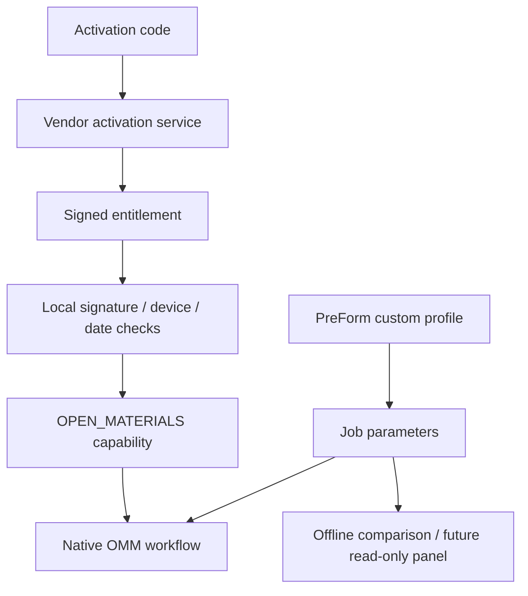

# Material settings and Open Material Mode: desktop handoff reconciliation

Review date: 2026-10-07. Scope: existing **Form 3 / Daguerre 2.5.6-2773** files,
prior static traces and synthetic tests. No printer connection, activation, material
write or print experiment was performed. This is not an editable-settings catalog
or a claim that all Formlabs materials are covered.

The owner's desktop handoff has SHA256
`0470753234f490afd5bbdfa04a52fa527b64d442de607296bc325fb9c4f6acee`.
It remains private: it contains cryptographic constants and vendor implementation
excerpts. Its embedded follow-up prompt is research input, not executed instructions.
The handoff does not supply a hash for every analyzed binary. Address matches alone
cannot establish that all desktop inputs were identical to this project's copies.

## What the comparison establishes

| Area | Comparison with existing work | Evidence and remaining limit |
|---|---|---|
| Activation voucher versus entitlement | Already recovered; handoff corroborates | RichardNixon ELF link VAs 0x695ac0 / 0x695c20 reach typed license retrieval/activation; request fields differ from returned signed entitlement. No request sent |
| License crypto | Already recovered more precisely | Palantir decode 0x78f61c, signature path 0x7a1918, original ChaCha20 dispatch 0x7a4518, JSON parser 0x790b30. Both handoff key fingerprints match prior findings; raw constants are not redistributed |
| Device/date validity | Prior work is further advanced than the handoff | Predicate 0x78ef44; modeled integer slice 0x78f108–0x78f148 requires strict start/end inequalities in normal mode. Three direct callers pass mode 0. Date parsing and a real signed entitlement remain separate acceptance questions |
| Shared capability enum | Already recovered | OPEN_MATERIALS is one enum member; Form 4 biocompatible/test members do not establish paid Form 3 products |
| OMM capability versus mode | Corroborated, not newly unlocked | A valid entitlement, runtime useOpenMode and a compatible job are separate conditions; a JSON boolean is not a manufacturer signature |
| Seven CleaningMeshes profiles | Newly reproduced systematic comparison | 750 parameter paths, 563 constant, 187 varying/absent; exact aggregate counts below |
| Profile/job identity | New conflict found in this comparison | All seven accompanying Job.json files name FLGPWH04; knob material identifiers name seven different materials. Do not silently select one as universal job truth |
| Heating/mixing in OMM | Conflicting source scopes remain visible | Recovered UI warning says disabled; current official documentation discusses temperature/mixer behavior. A UI sentence is not proof of all selected runtime consumers |
| SSH / remote assistance | Mostly already documented; setup script rechecked | Marker/firewall exposure remains distinct from key authorization. ZeroTier backend registration and bastion membership logic are present; no support session observed |
| Debug/factory/print-test | Useful leads, not owner enrollment | Build-gated QML and shared Form Auto fields are not proof of reachable Form 3 release controls |
| Tank reprogramming / unsecured cartridge policy | Distinct existing mechanisms | QML method presence does not prove eligibility, safe material conversion or an OMM entitlement. No new writer added |
| Update trust chain | Handoff's blanket OPEN is outdated relative to prior work | Authenticated 2.5.6 outer metadata/payload and inner OpenPGP layers were already verified. Raw encrypted input follows a different entry; not every version/rollback path is proved |
| Job container / dose to laser commands | Still partial | Metadata and parameter names are known; end-to-end precedence, units/conversion, calibration and hardware consumers need targeted evidence |
| LPU service menus | Useful repair research leads | Existing menus do not validate a replacement/calibration procedure or explain the printer's historical fault |

All VAs above are **ELF link virtual addresses**, not file offsets or runtime ASLR
addresses. The source-bound artifacts used here are:

| Artifact | SHA256 |
|---|---|
| `/usr/bin/Palantir` | `b99e5a789589a6811f0a6cd7848b44f8a6571ae73b77f6953112cd53d96021bc` |
| `/usr/bin/richard-nixon` | `277a6b3901006f7ec291d9e76bbf076fd12671429c769d5b63a78e25defb7f54` |
| `/usr/bin/TankCartridgeDaemon` | `a2a5e3c47cf1c0c2cc627bcfcba10c0c20a843420fa46ca39290be27e861a8c1` |
| `/usr/bin/PrinterLegitimacyChecker` | `a25130cfc3dd11f9c9d92139e281c1af10d5d911eb6f24e4bddbd087230ff476` |

The private developer repository retains the earlier disassembly/caller receipts
and authored `LICENSE_ENVELOPE`, `NATIVE_UI_CLOSURE_RESEARCH`, `UPDATE_PIPELINE`
and release-comparison reports. This source edition does not redistribute their
underlying proprietary extracts or turn historical traces into a new hardware test.

## Reproducible profile comparison

Inputs are the seven **bundled cleaning-job** directories under firmware path
`/usr/share/Formlabs/CleaningMeshes/`, not seven arbitrary user printing profiles.
The [sanitized receipt](../../analysis/material-settings/profile-comparison-2.5.6.json)
contains each input profile, Job.json and overrides hash, material labels and counts.
Locate an input by its hash if directory names differ in an extraction.

The label comes from `Material_Scene.identifier_materialCode`. Six profiles have
729 leaf parameters; FLDRBL01 has 643. Arrays count as **one parameter each**.
Flattening array elements instead would produce different counts (1051 union
paths); those elements are not independent controls.

| Compared scope | Union paths | Constant | Varying or absent |
|---|---:|---:|---:|
| Entire seven-profile set | 750 | 563 | 187 |
| Material_Daguerre_Print | 97 | 65 | 32 |
| Daguerre_Print | 65 | 58 | 7 |
| Material_Form2_Print | 64 | 64 | 0 |

Observed knob labels: FLDMBE02, FLGPCL04, FLGPBK04, FLELCL01, FLDLCL01, FLDUCL02,
FLDRBL01. All seven overrides files are empty objects. This proves only these
files contain no explicit override entries; it does not prove no runtime override
or calibration is applied elsewhere. The separate calibration profile is excluded.

**Identity conflict:** every bundled Job.json reports FLGPWH04, including the
directory whose knobs report FLGPCL04. The files are therefore unsuitable as an
unchecked round-trip template for a new user job. The inspector reports both
values and `material_match: false`; it never repairs or relabels them. The same
caution applies to job layer-height metadata versus values in the actual knobs.

```sh
# LAPTOP — already extracted local copies only; no device or vendor execution.
: "${CLEANING_MESHES_COPY:?set the copied CleaningMeshes directory}"
: "${PROFILE_REPORT:?choose a new private JSON report in an existing directory}"
python3 tools/compare_material_profiles.py "$CLEANING_MESHES_COPY" \
  --output "$PROFILE_REPORT"
python3 -m unittest discover -s tests -p test_material_profiles.py
```

Expected: counts/hashes and explicit unresolved runtime/editability status. The
tool rejects symlinks, duplicate/truncated JSON, nonfinite numbers, excessive
structure/size/profile counts and existing outputs. It creates a mode-0600 report.
Unknown JSON keys and arbitrary strings are never emitted; selected numeric values
require `--include-values` and remain an explicit parameter allowlist. Input file
hashes do not authenticate unknown firmware by themselves. No apply command exists.

## Least-invasive use of material settings and licensing

1. **Use PreForm's supported Print Settings Editor for exposed controls.** Its
   Form 3 generation table is the owner-facing interface; it is not a list of every
   internal knob. Custom settings can be exported/imported as FPS. A field's
   existence in a firmware JSON file does not prove that it is editable, active in
   this mode, or bounded safely. [Official editor documentation](https://formlabs.com/support/Using-the-Print-Settings-Editor/).
2. **Use a device-valid OMM entitlement for the native open-material workflow.**
   The existing local client verifies a signed/encrypted entitlement; the embedded
   decoder/public key does not supply the issuer's signing key. No valid owner
   entitlement was present in the originally inspected license directory. That
   historical absence does not establish today's live device state.
3. **Keep activation distinct from printing.** Formlabs documents an internet
   connection for activation and offline printing afterward; the Form 3 requirements
   list firmware 2.5.0+ and PreForm 3.37.1+. These are documentation claims checked
   on 2026-10-07, not new device acceptance. No activation request was sent.
   [Official activation documentation](https://formlabs.com/support/Setting-up-Open-Material-Mode/).
4. **Treat OMM's operating changes explicitly.** Official instructions disable
   automatic dispensing and automatic level warnings, and describe dedicated tank
   handling. OMM is not a proven replacement for the panel's desired live level
   gauge or an automatic safe refill controller.
   [Official OMM printing documentation](https://formlabs.com/support/Printing-with-Open-Material-Mode/).



This is the traced client architecture plus separately labeled official workflow,
not an activation performed by this project. There is no license generator, issuer
private key, signature bypass, generic settings writer or actuator endpoint here.
Rewriting a capability flag would be a different, unvalidated firmware modification,
not a minimally invasive implementation of the native licensing path.

## The heating/mixing discrepancy must stay visible

Palantir's embedded `qml/PrintConfirmationStackState.qml:107` contains the disabled
heating/mixing warning. Extract SHA256:
`30f408887384ae021c0cfff1ef816e561a627767bf83f0d0d0cd8be6df992e72`.

`qml/UserSettings/OpenModeModel.qml:88` calls `qml_Sync(!useOpenMode)`;
its SHA256 is `3bbf9f074ee385f06340674e40cd6e374a4b2cf754d9685b8121f9b92fc5339a`.
That proves the UI requests a setting change, not all lower-service side effects.
Current official OMM documentation describes temperature and mixer-dependent
recoating behavior. Firmware age, shared UI state and model-specific execution can
explain a difference, but none is silently selected as the answer. Trace actual
Form 3 dispatch and consumers before exposing heating/mixing controls or describing
either behavior as guaranteed for this acquired release.

## Useful next panel work, with explicit gates

| Candidate | Available evidence | Required before implementation / use |
|---|---|---|
| Profile origin, material identity and mismatch warning | New offline comparator; firmware files | Typed sanitized snapshot adapter with source/time labels; no full job/key exposure |
| Job profile revision, custom-setting and open-mode flags | Existing job parser leads 0x2e9ec0 / 0x241568 | Verify exact stored field/type and live freshness; unknown must stay unknown |
| Active OMM entitlement explanation | Client verifier and separate settings known | Real entitlement/current mode read source and native validity semantics; decoded is not active |
| Parameter comparison / change preview | New bounded numeric allowlist | PreForm UI-to-field mapping, ranges, precedence and round-trip fixtures; no global vendor config writes |
| Remote assistance state | Setup script + privacy/UI lifecycle | Distinguish preference, running overlay and actual reachability; no claim of cloud invisibility |

The present panel's FLOPEN01 entry remains `READ ONLY / VALIDITY UNKNOWN`.
No speculative switch was added and no running panel was upgraded. The most useful
next evidence is a pair of owner-created PreForm/FPS or job exports differing in
one parameter, with exact PreForm/model/profile versions. Such files can be compared
offline; they need not be printed or sent to a vendor. Trace dose-to-scan/calibration
consumers separately before enabling any low-level parameter mutation.
