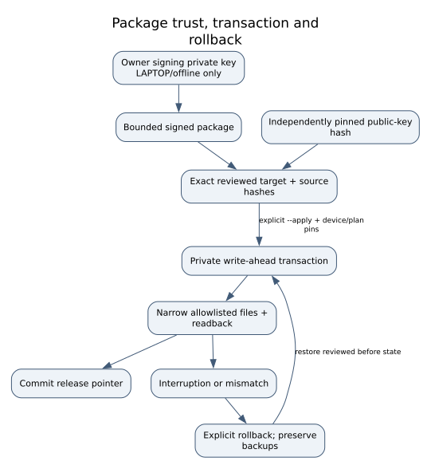

# Modification map

Read this before the first write. Commands live in the
[canonical walkthrough](COMMAND_WALKTHROUGH.md); this map explains scope and
recovery. Evidence labels are defined in [Evidence status](EVIDENCE_STATUS.md).
No row authorizes a different chip, board, partition layout or firmware.

| Component / original prerequisite | Exact change and purpose | When / persistence | Recovery and proof |
|---|---|---|---|
| Same-printer 4 MiB QSPI, reviewed hash/layout | Active environment at `0x0c0000`, length `0x4000`: remove reviewed `silent`, select external initramfs; rebuild CRC32 | Rescue build, then deliberate clip write; temporary boot modification | Restore independently retained same-printer original through the gated programmer/readback route. [Builder](../../tools/build_qspi_rescue.py), [tests](../../tests/test_rescue.py), acquisition receipt |
| Verified all-FF reserve `0x100000..0x400000` (end exclusive) | Place bounded authored rescue payload starting at `0x100000` | Same temporary QSPI image; no replacement SPL/U-Boot | Builder must prove all bytes outside permitted environment/reserve unchanged; original restores both regions. Unknown/non-FF reserve stops |
| Genuine selected-slot kernel/DTB | Load with authored RAM initramfs; `rdinit=/init`, protected storage, isolated raw shell | Rescue only; RAM root. Not a manufacturer userspace installation | Original QSPI returns the vendor boot path. [Init](../../rescue/rootfs/init), [historical receipt](../../rescue/hardware_results.json) |
| p6 / 2.5.6-2773 with no pending flip | Append collision-checked `owner-maint` non-login UID/GID in `/etc/passwd` and `/etc/group` (64900–65000) | First persistent eMMC changes occur at the approved writable mount/journal step, before file apply | Exact before/after records; matched installer rollback. Root shadow unchanged. `Target.preflight`, `plan`, `apply_install` in [ownerctl](../../owner-maintenance/ownerctl.py) |
| p6 SysV startup | Add `/etc/init.d/owner-maintenance`, relative `/etc/rc5.d/S98owner-maintenance`, `/usr/local/sbin/ownerctl` | Persistent, nonblocking owner startup; vendor hooks/S99boot-ok retained | Recorded restoration/removal; preserve p5 initially. [Hook](../../owner-maintenance/owner-maintenance.init), [installer fixtures](../../tests/test_owner_install.py) |
| p7 mounted as `/data` | `/data/owner-maintenance/bootstrap/` contains verified ownerctl, package verifier, supervisor, socket launcher, LAN helper and scoped cartridge broker/codec/transaction modules; `releases/<version>/` contains panel source/assets | Install/maintenance update; signed exact member set in [package_format](../../owner-maintenance/package_format.py) | Transactions preserve changed bytes. A panel-only package cannot replace bootstrap. p7 survival alone does not preserve a p6 startup hook across vendor updates |
| Separate owner sshd | Reuse vendor OpenSSH executable with generated owner configuration, publickey-only root access and internal-sftp on **SSH :2222** | Normal owner supervisor; address-bound, narrow owner firewall chains; optional distinct LAN policy | Owner-service disable/rollback; no vendor CA/host identity or host-wide client policy change. [bootstrap](../../owner-maintenance/bootstrap.py), [SSH reference](SECURE_SSH.md) |
| Owner client authorization | `/data/owner-maintenance/ssh/authorized_keys` contains enrolled owner public key; private client key remains on laptop | Persistent enrollment; unrelated to panel secret | Preserve independently backed-up named client key; review matching transaction before changes. No default/shared password |
| Owner server identity | Separate `/data/owner-maintenance/ssh/host_ed25519` generated on accepted normal startup | Persistent private host key; isolated first-use enrollment | Retain dedicated laptop known_hosts pin. DHCP changes do not justify replacing it. Vendor host keys untouched |
| Owner panel | Primary inherited **HTTPS :1328**, privilege drop; optional exact-address private-LAN **HTTP :1328** | Unprivileged normal service; panel initially disabled until separate enrollment | SSH survives panel failure; certificate renewal is a typed transaction. HTTP is plaintext. [launcher](../../owner-maintenance/socket_launcher.py), [server](../../owner-ui/server.py) |
| Owner configuration and state | `config/service.json`, optional `config/owner-lan.json`, `panel-identity/`, `state/`, `current.json`; runtime files under `/run/owner-maintenance` | p7 persistent settings/credentials; `/run` volatile | Plan/apply/verify; no ad-hoc edits to pinned configuration. Owner preferences are not vendor policy or physical sensor values |
| Package authorization | Separate owner RSA signer; `config/signing-public.pem` plus independently retained public-PEM SHA256 pin; signed canonical manifest and file hashes | Every install/update | Refuse wrong signer/member/target. Private signer never goes to printer. Source-review tarballs are **unsigned**. [Package tests](../../tests/test_owner_install.py) |
| Transaction and backups | `installed.json`, `pending.json`, `transactions/<plan-hash>.json`, `.transaction-lock`, retained releases and before/after records | Persistent p7 recovery state; backup separately to laptop | No atomicity claim across all files. Pending/foreign changes stop; matched explicit rollback only, never blind rerun |
| Optional Clear usage adjustment | Separate authenticated broker changes only validated legacy Clear usage mirror and two RW records (B 96/16, A 64/16); RO/identity/material retained | Explicit operation **after** installation, not part of root acquisition | Private durable backup/readbacks and recovery lock. [Detailed scope and evidence](CARTRIDGE_PANEL_RESET.md); no automatic refill or physical-full claim |
| Optional touchscreen clock / splash | Hash-pinned p6 RCC binding or bounded splash image allocation | Separate reviewed native-display transaction; never implicit in panel install | Restore privately retained originals; [native display profiles](NATIVE_DISPLAY.md). No vendor binary redistributed |
| Original QSPI return | Full restoration of the same printer's original 4 MiB image, complete independent readback | After owner-file verification; returns normal manufacturer boot | Does **not** remove p6/p7 owner files. Rescue failure branch and electrical gates apply again |

## What stays outside the owner installation

No p1 identity/calibration, p2 metrics, p5 rootfs, partition table, boot0/boot1,
RPMB/EXT_CSD provisioning, vendor shadow, manufacturer update trust, consumable
memory or actuator changes are part of the installer. Normal vendor startup has
its own writes. An ext4 write mount/journal replay changes metadata beyond the
logical file list; no block-level “only these file bytes change” claim is made.

## Audit and recovery checkpoints

*SOURCE / FIXTURE architecture. Solid arrows are owner transaction stages;
rollback is explicit and conditional on matching records, not a power-loss guarantee.*

Before QSPI write: three matching meaningful reads, independent backup, exact
part/power/layout gates. Before eMMC write: full user-area/boot backups, filesystem
recovery decision, current affected-file backups and fresh device-bound plan.
Before normal boot: verified installed files, retained rollback, original QSPI
readback and independently isolated networking. If any checkpoint fails, use the
[walkthrough recovery point](COMMAND_WALKTHROUGH.md#phase-map) rather than advancing.
