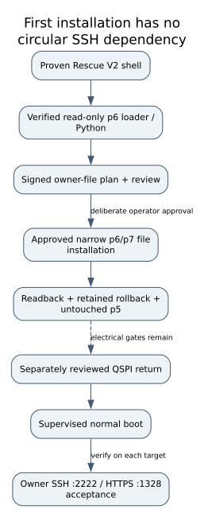

# First installation, ordinary use and rollback

Use the [command walkthrough](COMMAND_WALKTHROUGH.md) for the explicit sequence,
including each transfer, filesystem/write gate and final readback. This chapter
explains the installer model and optional later panel/maintenance operations.

This guide starts with an already verified Rescue V2 shell. It does **not** assume
normal owner SSH exists before the initial installation. A stock printer first
needs the separately gated [root/acquisition route](ROOT_GUIDE.md). The code permits
only the reviewed p6 / 2.5.6-2773 target, fresh boot selection and no pending flip.
Read the whole sequence, including recovery, before a persistent change.

This is tutorial chapter 2. Chapter 1 covers the temporary RAM root and backups;
chapter 3 provides the [complete SSH enrollment and acceptance procedure](SECURE_SSH.md).
The panel, native clock and artwork are optional additions, not prerequisites for
an authenticated root shell. The installer never supplies its own initial root.

## 1. LAPTOP: source review and independent owner authority

Run [build/tests](BUILD.md). Keep evidence, current affected-file backups and accepted
source receipts independently. `VERSION` identifies the source; source tarballs
and synthetic fixture signatures provide no installation authority.

Create a **new** private directory and named keys after reviewing the choice:

```sh
# LAPTOP — local files only; never overwrite default SSH identities.
umask 077
: "${OWNER_PRIVATE:?new private deployment directory, outside the clone}"
[ ! -e "$OWNER_PRIVATE" ] || { printf 'STOP: directory already exists\n'; exit 1; }
mkdir -m 700 -- "$OWNER_PRIVATE"
ssh-keygen -t ed25519 -f "$OWNER_PRIVATE/owner-client-ed25519" -C 'owner-maintenance'
openssl genpkey -algorithm RSA -pkeyopt rsa_keygen_bits:3072 \
  -out "$OWNER_PRIVATE/owner-package-signing.pem"
openssl pkey -in "$OWNER_PRIVATE/owner-package-signing.pem" -pubout \
  -out "$OWNER_PRIVATE/owner-package-public.pem"
sha256sum "$OWNER_PRIVATE/owner-package-public.pem"
ssh-keygen -lf "$OWNER_PRIVATE/owner-client-ed25519.pub"
```

Choose a client-key passphrase and use a local SSH agent for convenient daily login.
The package signer is a **separate** authority and remains on the laptop/offline
storage. Its generated file is protected by the private directory/umask; safeguard
that unencrypted signing file accordingly. Do not deploy test keys, copy any private
client/signer key to the printer, overwrite existing keys or reuse vendor credentials.
Retain the public PEM hash independently rather than trusting a key inside a package.

```sh
# LAPTOP — independent pin entered from the preceding reviewed public fingerprint.
: "${OWNER_PRIVATE:?private deployment directory}"
: "${OWNER_SIGNER_PIN:?independently retained public PEM SHA256}"
: "${INSTALL_PACKAGE:?new private .tar.gz output path}"
OWNER_VERSION=$(cat VERSION)
python3 tools/build_owner_package.py build --kind install --version "$OWNER_VERSION" \
  --signing-key "$OWNER_PRIVATE/owner-package-signing.pem" \
  --public-key "$OWNER_PRIVATE/owner-package-public.pem" \
  --signer-sha256 "$OWNER_SIGNER_PIN" --package "$INSTALL_PACKAGE"
python3 tools/build_owner_package.py verify --package "$INSTALL_PACKAGE" \
  --public-key "$OWNER_PRIVATE/owner-package-public.pem" --signer-sha256 "$OWNER_SIGNER_PIN"
sha256sum "$INSTALL_PACKAGE"
```

Expected: independently pinned RSA/SHA256 signature, permitted paths and exact
package/manifest hashes. New output is required; collision or signature failure
stops. Archive links/devices/traversal/unexpected expansion are rejected.

Prepare a private initial JSON with the exact reviewed Ethernet client subnet:
`{"interface":"eth0","client_network":"192.168.50.0/24","panel_enabled":false}`
is a **synthetic example**, not a value to copy blindly. Use the smallest applicable
range for the actual isolated service segment. Normal boot uses DHCP through
ConnMan; rescue's static IP is not a promised normal address. Keep panel disabled
until independent SSH host-trust and TLS enrollment. Do not ad-hoc edit installed
configuration later; signed maintenance/config transactions are separate operations.

## 2. RESCUE: current state, journal decision and runtime verification

Confirm root, model/ARM architecture, `rdinit=/init`, actual eMMC capacity, partition
layout and read-only flags. Identify the current selected slot from a **fresh** active
U-Boot environment, not the old acquisition. Inspect mounts before adding any:
never silently remount an existing filesystem or replay/repair an original image.

The reviewed inspection shape uses sibling mounts `/mnt/owner-slot` and
`/mnt/owner-data`, so `/data` is not accidentally hidden beneath another tree:

```sh
# RESCUE — ONLY after device/partition/read-only checks and confirming these are unmounted.
mkdir -p /mnt/owner-slot /mnt/owner-data
mount -t ext4 -o ro,noload,nodev,nosuid /dev/mmcblk0p6 /mnt/owner-slot
mount -t ext4 -o ro,noload,nodev,nosuid,noexec /dev/mmcblk0p7 /mnt/owner-data
cat /proc/mounts
```

The deliberately executable p6 inspection mount is only for the verified genuine
loader/Python/OpenSSL; p7 stays noexec. No vendor startup/site/installer is run.
Read filesystem recovery flags/health without repair. An unreplayed dirty view makes
a plan provisional. Any later authorized journal recovery requires fresh inspection
and a rebuilt plan; `rw,noload` is not a safe repair shortcut.

BusyBox V2 lacks Python/tar/chmod/full coreutils. Individually transfer the small
authored `ownerctl.py`, `package_format.py`, `capture_owner_bootenv.py`, source
package, public keys, configuration and `RESCUE_RUNTIME_SHA256SUMS` to **new RAM
files**, using a bounded reviewed transfer. Verify complete sizes/hashes before
execution. Keep private signing/client keys on LAPTOP. Never stream a transfer into
a block device or exceed available RAM. The raw transport is physically isolated.

For clarity, a single-file bootstrap transfer has two terminals. First make the
reviewed source available on PI through its already pinned management SSH/SFTP
connection. Check size/hash there against LAPTOP. Then, in the identified RESCUE
shell, receive into a **new** RAM filename with a deadline:

```sh
# RESCUE — isolated service cable only; use a NEW filename on every retry.
[ ! -e /run/ownerctl.py ] || { printf 'STOP: RAM destination exists\n'; exit 1; }
umask 077
timeout 60 nc -l -p 9001 > /run/ownerctl.py
wc -c < /run/ownerctl.py
sha256sum /run/ownerctl.py
```

While that listener waits, send the already reviewed file from the second terminal:

```sh
# PI — ./ownerctl.py is the verified authored source copy, not a firmware binary.
# 10.0.0.77 is the reviewed Rescue V2 protocol address, not normal WLAN addressing.
nc -w 10 10.0.0.77 9001 < ./ownerctl.py
```

Do not infer completion from a timeout or connection closure: both the printed
length and SHA256 must equal the independently retained LAPTOP values. The raw
listener is unauthenticated; no bridge, forwarding or other peer is permitted.
Remove no original evidence on failure; leave the partial RAM file and use a new
name if a reviewed retry is necessary. This transfer writes only the named RAM file.
Repeat the same reviewed size/hash procedure for each item in this table, changing
both filenames together; do not execute a partially received program.

| LAPTOP source | RESCUE RAM destination | Purpose |
|---|---|---|
| `owner-maintenance/ownerctl.py` | `/run/ownerctl.py` | Typed installer/preflight |
| `owner-maintenance/package_format.py` | `/run/package_format.py` | Adjacent verified package library |
| `tools/capture_owner_bootenv.py` | `/run/capture_owner_bootenv.py` | Fresh environment read/CRC |
| Authenticated exported `RESCUE_RUNTIME_SHA256SUMS` | `/run/RESCUE_RUNTIME_SHA256SUMS` | Verify the mounted genuine runtime |
| Your signed install package | `/run/owner-install.tar.gz` | Bounded owner package; not a vendor installer |
| Your signer **public** PEM | `/run/owner-package-public.pem` | Independent pinned verification authority |
| Your client **public** key | `/run/owner-client.pub` | Owner SSH authorization |
| Reviewed initial service JSON | `/run/owner-service.json` | Ethernet interface/client range; panel initially disabled |

Check available RAM before the batch. These are small authored files/public inputs,
not a whole rootfs transfer. No private client/package-signing key belongs on PI
or the printer. `ownerctl` explicitly invokes the mounted slot's verified OpenSSL
via its loader in rescue context; a global PATH or `/lib` replacement is unnecessary.

The exported runtime manifest contains 3,157 **hash/size/path records only**, derived
from the reference p6 inventory. Verify every required regular file and resolve
loader symlinks under the mounted slot. In RESCUE, after checking the checksum file's
own transfer hash, `cd /mnt/owner-slot` and `sha256sum -c /run/RESCUE_RUNTIME_SHA256SUMS`
checks content using BusyBox. Missing, changed or unexpectedly escaping paths stop
runtime execution; the trusted manifest does not grant permission to substitute a
newer runtime. Do not globally change PATH/loader configuration.

Define a temporary invocation for the already verified runtime:

```sh
# RESCUE — verified mounted binaries only; no Python site/startup or bytecode writes.
owner_python() {
  PYTHONHOME=/mnt/owner-slot/usr \
    /mnt/owner-slot/lib/ld-linux-armhf.so.3 \
    --library-path /mnt/owner-slot/lib:/mnt/owner-slot/usr/lib \
    /mnt/owner-slot/usr/bin/python3.5 -B -S "$@"
}
owner_python /run/capture_owner_bootenv.py --output /run/owner-active-env-review.bin
owner_python /run/ownerctl.py preflight --context rescue \
  --slot-root /mnt/owner-slot --data-root /mnt/owner-data \
  --boot-env /run/owner-active-env-review.bin
```

The capture selects the unique `uboot environment` MTD character device and verifies
its identity and active 16 KiB CRC. It writes only a new RAM capture. Expected
preflight: slot 6, no pending flip, firmware 2.5.6-2773, matching layout/identity.
CID remains private; report the fingerprint. Existing owner installation or pending
transaction means verify/review it, not blindly repeat first installation.

## 3. RESCUE: exact plan, backup and deliberate apply

With reviewed RAM filenames and independent signer pin:

```sh
# RESCUE — plan reads target state and writes only the new RAM report.
: "${OWNER_SIGNER_PIN:?independent signer public PEM hash}"
owner_python /run/ownerctl.py plan --context rescue \
  --slot-root /mnt/owner-slot --data-root /mnt/owner-data \
  --boot-env /run/owner-active-env-review.bin --package /run/owner-install.tar.gz \
  --public-key /run/owner-package-public.pem --signer-sha256 "$OWNER_SIGNER_PIN" \
  --owner-key /run/owner-client.pub --config /run/owner-service.json \
  --output /run/owner-plan.json
```

Copy the plan and current affected-file backups privately to LAPTOP. The plan wraps
`plan` and its canonical `plan_hash`; the plan hash is **not** a raw hash of the
pretty-printed JSON file. Review target/device, slot/version, public pins, account
collisions, package hash, exact changes and filesystem recovery state.

| Persistent scope | Purpose / rollback basis |
|---|---|
| p6 `/etc/passwd`, `/etc/group` | Add one non-login owner UID/GID after collision check; saved exact before/after bytes |
| p6 `/etc/init.d/owner-maintenance`, `/etc/rc5.d/S98owner-maintenance` | Nonblocking SysV hook and relative link; no vendor-service replacement |
| p6 `/usr/local/sbin/ownerctl` | Fixed transaction wrapper |
| p7 `/data/owner-maintenance/` | Root-owned bootstrap, signed releases, pins/config, public SSH authorization and private transactions |
| Runtime `/run/owner-maintenance` | Runtime status/sockets; bounded owner firewall rules only during accepted startup |

No p1/p2/p5, shadow, calibration, vendor key, boot-area or consumable write is part
of this file transaction. A write mount/journal operation also affects ext4 metadata;
the path scope is not a claim about exclusive physical byte ranges.

**Separate deliberate write gate:** preserve backups, settle any required recovery,
revalidate the plan and authorize only necessary p6/p7 writable mounts/protection
state. No blanket block flag clearing, `rw,noload`, repair or whole-image restore is
supplied by ownerctl. Its apply checks require the exact writable mount sources.
Only then repeat with `install`, the same context/boot/package/public/owner inputs,
`--plan /run/owner-plan.json --plan-hash "$PLAN_HASH" --device-id "$DEVICE_ID" --apply`.
Guard these variables with `: "${PLAN_HASH:?}"` and `: "${DEVICE_ID:?}"` first.
Run `ownerctl verify` through the same loader/context immediately afterward.

The explicit apply shape, **only after that separate filesystem/write decision**, is:

```sh
# RESCUE — PERSISTENT WRITE. This is not part of read-only preparation.
: "${PLAN_HASH:?exact reviewed canonical plan hash}"
: "${DEVICE_ID:?exact reviewed target fingerprint}"
owner_python /run/ownerctl.py install --context rescue \
  --slot-root /mnt/owner-slot --data-root /mnt/owner-data \
  --boot-env /run/owner-active-env-review.bin --package /run/owner-install.tar.gz \
  --public-key /run/owner-package-public.pem --owner-key /run/owner-client.pub \
  --plan /run/owner-plan.json --plan-hash "$PLAN_HASH" --device-id "$DEVICE_ID" \
  --apply --output /run/owner-install-result.json
owner_python /run/ownerctl.py verify --context rescue \
  --slot-root /mnt/owner-slot --data-root /mnt/owner-data \
  --boot-env /run/owner-active-env-review.bin --output /run/owner-verify-result.json
```

The apply re-verifies package, signer pin from the reviewed plan and current target;
it cannot silently turn a read-only mount into a writable one. Failure is a stop.
Keep source/plan/output hashes with the private transaction copy. Do not proceed
to QSPI return with verification discrepancies or a pending transaction.

Expected: committed transaction, matching readback, no `pending.json`. Copy private
receipts/rollback originals to LAPTOP. Interruption or unrelated file change means
stop and resolve the matched transaction, not repeat installation. Close mounts,
sync and restore the deliberate protection state under the reviewed procedure.

## 4. PHYSICAL: return to the same printer's original QSPI



*There is no dependency on already-working normal owner SSH during first install.*

Only after successful install/readback and prepared rollback, follow the separately
reviewed electrical/write/readback gate to restore **that printer's original QSPI**.
Preserve a fresh pre-read and verify a complete independent readback. The installer
does not flash, change boot variables, reboot, kexec or run vendor init. Restoring
original QSPI restores normal boot logic; it does not undo the owner eMMC files.

Before normal power-on, establish independent isolation for **all** possible paths:
Ethernet, saved WLAN, IPv6, USB networking and host relays. Prepare an isolated DHCP
service with a nonoverlapping subnet and a retained management/recovery route.
Do not assume blocking a few hostnames isolates the printer. Normal vendor startup
can write logs/state even when observation commands are read-only.

## 5. NORMAL PRINTER/LAPTOP: first trust, then panel

Follow the expanded [secure SSH chapter](SECURE_SSH.md) for exact first-enrollment,
strict reusable profile, wrong-key test, RAM SFTP roundtrip and DHCP-change steps.
The summary below explains how those SSH steps fit panel enrollment.

Determine the current address from the isolated DHCP lease/local identity evidence.
A newly generated owner SSH host key has no pre-existing pin. Acquire its fingerprint
only over the independently verified physical service segment, correlate it with the
rescue device identity and retain a dedicated known_hosts file. `ssh-keyscan` on an
ordinary LAN is not authentication. A changed existing pin stops; never disable
StrictHostKeyChecking or weaken host-wide SSH algorithms.

```sh
# LAPTOP — once host trust is independently established and retained.
: "${OWNER_KEY:?named owner private client key}"
: "${PRINTER_HOST:?verified current DHCP address or local name}"
: "${OWNER_KNOWN_HOSTS:?dedicated verified known_hosts file}"
ssh -F /dev/null -i "$OWNER_KEY" -p 2222 -o IdentitiesOnly=yes \
  -o StrictHostKeyChecking=yes -o UserKnownHostsFile="$OWNER_KNOWN_HOSTS" root@"$PRINTER_HOST"
sftp -F /dev/null -i "$OWNER_KEY" -P 2222 -o IdentitiesOnly=yes \
  -o StrictHostKeyChecking=yes -o UserKnownHostsFile="$OWNER_KNOWN_HOSTS" root@"$PRINTER_HOST"
```

Verify actual kernel, UID0, two concurrent sessions, wrong-key/password rejection,
SFTP RAM roundtrip/hash, installed version/slot and vendor startup. Retain one SSH
session during panel enrollment. Absence of rescue ports 2323/2324 matters. Process
presence or the UI Idle string alone is not an authoritative safe-to-act signal.

Use `ownerctl enroll-panel --context normal --slot-root / --data-root /data` with
reviewed `--tls-cert`, `--tls-key`, `--access-secret` and a new `--output` plan.
The certificate must match its key, validity and actual current private-IP SAN;
verify it using the explicitly retained owner CA/leaf. Review then apply with that
plan/hash/device fingerprint. Enrollment does not change vendor TLS or SSH identity.
Secrets never belong in URLs, terminal transcripts or Git. Do not bypass certificate
validation. Verify HTTPS1328, authentication, CSRF, unprivileged UID and SSH survival.

Optional WLAN HTTP is plaintext and explicitly scoped to the current eligible
private interface/subnet; no wildcard/IPv6/router exposure. The reference build
supports a deliberate local login preference, but disabling login gives trusted-subnet
peers access to the allowed panel data/actions. Cookies/CSRF do not add encryption.
Prefer authentication and HTTPS for credentials/private exports. A generic home LAN
is not equivalent to the physically isolated rescue link. Wi-Fi service configuration
uses a separately reviewed maintenance transaction with rollback, not an untracked
edit to `service.json`. Keep the working wired path until migration is accepted.

## 6. Ordinary updates, disable and recovery

Build a new `--kind panel` package with your signer, verify locally and transfer it
through pinned SFTP to a new `/run` file. Private signing keys remain on LAPTOP.

```sh
# NORMAL PRINTER — no write during plan, no QSPI or full-printer reboot.
: "${STAGED_PACKAGE:?verified staged panel package}"
: "${NEW_PLAN:?new plan file}"
ownerctl update --context normal --slot-root / --data-root /data \
  --package "$STAGED_PACKAGE" --output "$NEW_PLAN"
```

Require `operation=panel-update`, correct version/device/package/signer,
`bootstrap_changed=false`, `ssh_changed=false` and a verified current baseline.
Repeat with the exact guarded plan/hash/device and `--apply`; then run
`ownerctl verify --context normal --slot-root / --data-root /data`. The supervisor
reloads the panel independently; eight retained releases is the bound. Do not delete
vendor data to bypass limits. Maintenance/bootstrap changes use a distinct package.

| Failure | Response / boundary |
|---|---|
| Signature, target, file or profile mismatch | Stop; never replace a pin with an untrusted reported value |
| Pending/interrupted transaction | Preserve records; matched `rollback` with latest transaction hash/device and `--apply`; reject unrelated changes |
| Panel/certificate/DHCP issue | Keep SSH; inspect owner status and plan `renew-panel` with new valid identity, not a TLS bypass |
| Owner services need disabling | Reviewed `/data/owner-maintenance/disabled` marker stops only owner listeners; existing SSH sessions may persist |
| Complete uninstall | Fixture/rescue only; reverse bounded recorded p6/p7 owner changes, preserving private keys/state/backups as documented in code |
| No normal access | Independently reviewed Rescue V2 path and private rollback records; no blind whole-eMMC restore |
| A/B vendor upgrade | Hook/runtime/slot may change; unknown versions fail closed. Persistent p7 files do not prove startup survival |

The supervisor uses bounded retry/backoff; it does not intentionally stop forever
after three panel starts. It must not block S99boot-ok or vendor printing startup.
Do not stop Sauron, logging, ConnMan, thermal protection or other vendor services
for a cosmetic panel state. Native clock/logo work is optional and separate.
A sustained print and diagnosis of the original LPU/heating fault require their own
supervised acceptance. No repair success follows merely from root or a working panel.
