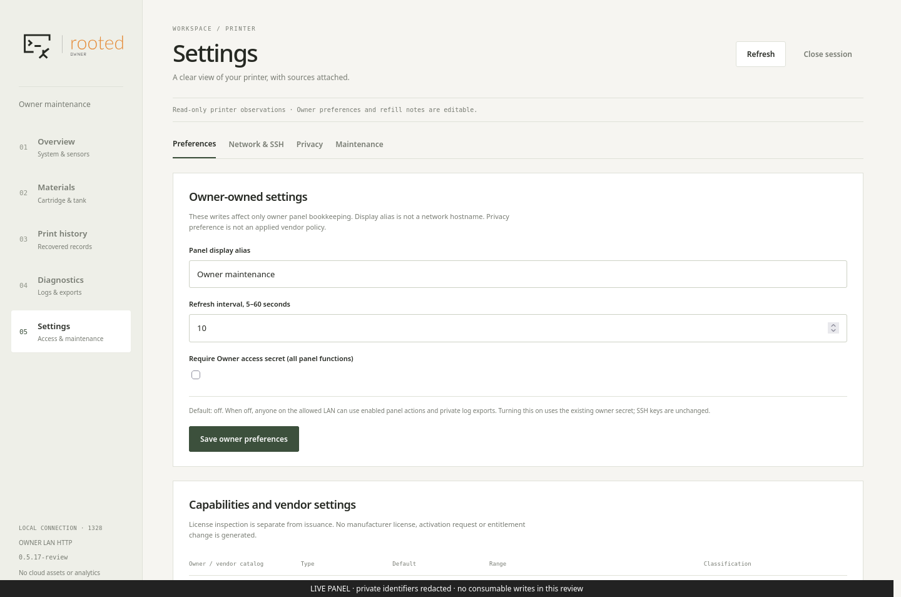
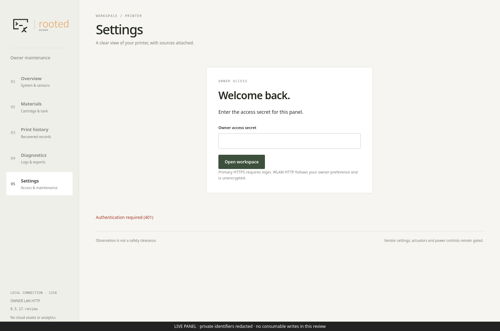
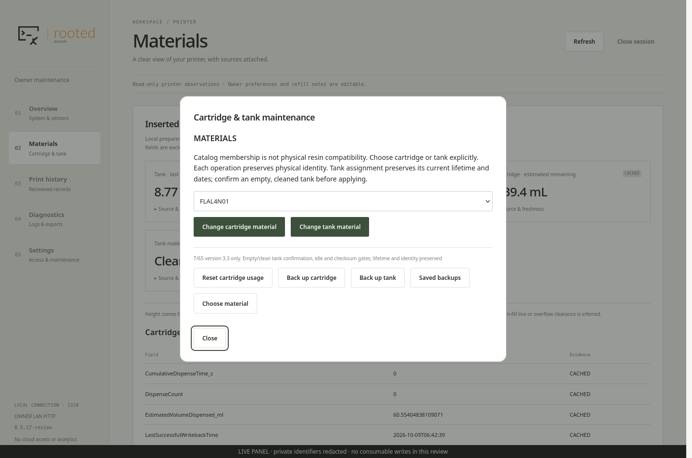
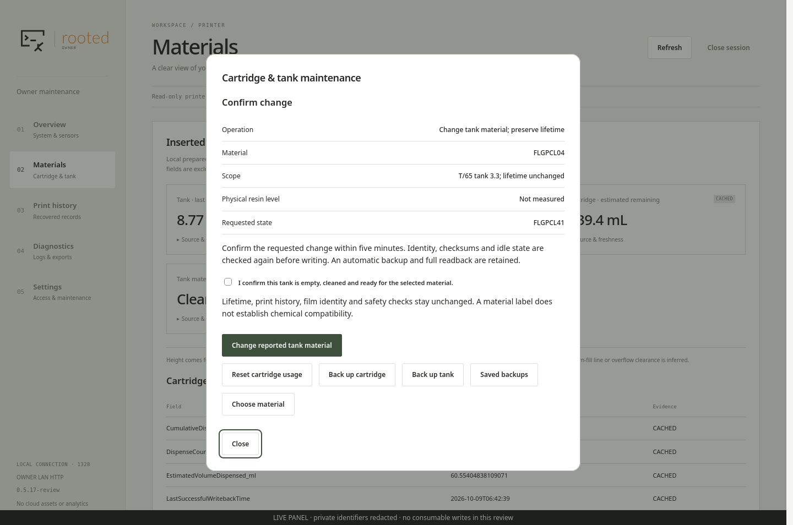
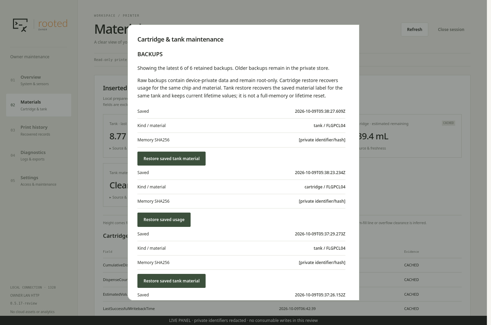

# Panel access and direct consumable actions

From 0.5.17, **Settings → Require Owner access secret (all panel functions)**
controls login and sensitive-action reauthentication together. The default is
**off** when no owner policy has been saved. An existing enabled policy remains
enabled across an update. The switch applies to both owner panel listeners; it
does not change SSH keys, host trust, TLS, interface binding or source subnets.

## Open and protected modes

In open mode, any client on an allowed owner LAN can start a browser session,
change owner settings, use enabled consumable operations and explicitly download
allowlisted private logs. This is not authentication. The session still carries
an expiring cookie and CSRF token. Exact Host/Origin, interface/address checks,
request limits, file allowlists and transaction checks remain active.

In protected mode, the existing enrolled owner secret is required for login and
sensitive actions. Enabling the switch immediately rejects anonymous sessions,
including those opened before the change. Disabling it requires a session allowed
by the current policy. No new shared/default password is created. The retained
secret file supports re-enabling protection; the option does not delete it or
expose it through an API. Invalid policy files fail closed. HTTP remains plaintext.

The persisted field is still named `wlan_login_required` for compatibility with
older packages. Its scope in this version covers all panel functions/listeners.
A rollback to 0.5.16 restores that version's narrower policy: primary HTTPS and
consumable maintenance require authentication even when WLAN viewing is open.
A runtime without a writable owner store remains protected.

## Direct actions, internal validation

Open **Materials → Manage cartridge & tank**. Use **Reset cartridge usage**,
**Choose material**, **Saved backups**, or either backup button. Material and
restore actions automatically prepare a bounded transaction. There is no separate
manual preview button or before/after preview table. After the internal checks,
**Confirm change** shows the intended operation/material and an apply button.
Tank changes still require the explicit empty/clean acknowledgement. Protected
mode also asks for the secret; open mode has no password or secret field.

This is a UI simplification, not removal of the transaction plan. Its expiry,
identity/material matching, firmware pins, full native idle check, backup,
writer exclusion, checksums, byte comparison, readback and recovery marker remain.
The browser never writes automatically after navigation, reopening a dialog or
refreshing a page. A final deliberate button press is required. Preheat can block
writes while read-only status/backups remain available. No actuator, license,
lifetime-reset or unknown-format operation becomes available through this switch.

[Consumable scope](CONSUMABLE_BACKUPS.md) and [tank transaction limits](TANK_MATERIAL_PANEL.md)
still apply. Earlier screenshots and acceptance receipts describe their recorded
versions; they are not rewritten as acceptance of this release.

## Verification

[HTTP policy tests](../../tests/test_panel_access_policy.py) exercise open mode,
protected mode, immediate policy changes, private export, malformed policy and
CSRF/Host/Origin rejection using synthetic helpers. The isolated Firefox workflow
covers all nine pages, both access modes, setting changes, explicit consumable
confirmation and synthetic writes. Real consumable writes are not used to test
an authentication preference or take screenshots.

## Installed reference and live captures

The [0.5.17 receipt](panel_access_acceptance.json) binds the signed panel package,
source, plan and tests. Installation verification, genuine Python 3.5 compilation
and direct browser acceptance passed. Only the panel was replaced: SSH, bootstrap,
vendor processes and boot identity stayed unchanged. No consumable write occurred.

In the live browser, the option was switched **off → on → off**. Enabling it
rejected the open session; the existing secret then allowed login. The final
configuration is off. Material catalog, saved backups and tank confirmation
opened without a password field. Private-log downloads also omit that field in
open mode; no private log contents were downloaded for these screenshots.

The five original screenshots below have private hostname, addresses and
consumable identifiers obscured before capture; PNG metadata was removed. They
show actual installed pages. The requested FLGPCL41 assignment was not applied;
the review ended with a matching FLGPCL04 no-op.

