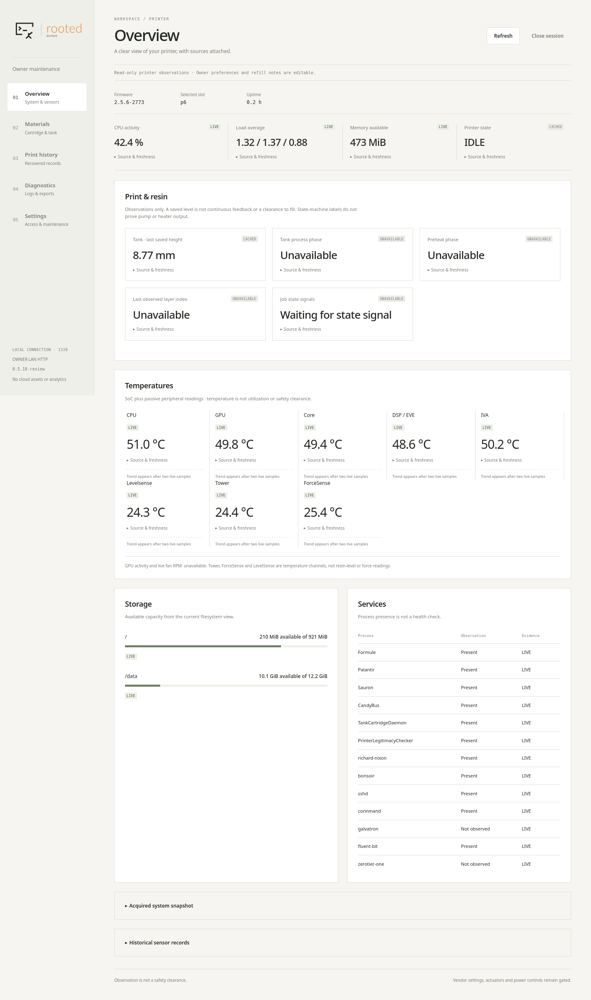

# Passive state and sensor update: 0.5.18

This update turns selected firmware findings into read-only panel improvements.
It does not enable new vendor commands or expand the supported firmware beyond
the reference Form 3 / Daguerre, p6, **2.5.6-2773**.

## Panel changes

Overview now includes **Preheat phase** and **Tank process phase**. Both come
from the existing passive Sauron `statesChanged` subscription. They describe
software workflow phases, not heater output, motor activity or measured resin
height. No extra vendor getter is polled by the panel.

Malformed/faulted temperature or state updates invalidate the prior live value.
Native state lists also contain internal task labels: the parser omits those
labels, reports an incomplete projection, and never treats it as safe-idle
permission. State data expires after 60 seconds; peripheral temperatures after
10 seconds. A disconnect or producer change invalidates the cache.

The last saved tank height remains **CACHED**, with unknown measurement age.
ForceSense and Levelsense temperatures are not force or resin-level readings.
Fan RPM and GPU utilization remain unavailable as live panel sources.

## Reference-device acceptance

The [sanitized receipt](../../analysis/panel50/live-acceptance-0518.json) binds
the installed package to source commit
`7973a1ccbd854b9f46953557adb57f2473269027`. The curated public tree has its own
commits and tests; it does not include the private developer history.

**HARDWARE OBSERVATION:** the signed panel-only update from 0.5.17 to 0.5.18
verified before and after installation on the genuine Linux 4.9.65+ / Python
3.5.3 system. Bootstrap, service configuration and owner SSH stayed unchanged.
The supervisor reloaded only its panel child; the printer did not reboot.
An old panel release was transactionally archived with its bytes retained.

Eight temperature channels were observed live: CPU, GPU, core, DSP/EVE, IVA,
Tower, ForceSense and Levelsense. This proves delivery/parsing, not calibration
or component health. Separate reviewed one-shot state queries reported idle and
no current print. No state transition arrived during the 30-second passive probe;
the new phase cards correctly remained **UNAVAILABLE**. Active preheat/filling
transitions are still unconfirmed on hardware for this extension.

Direct WLAN HTTP acceptance checked complete asset bytes, session cookies,
Host/Origin rejection, CSRF rejection and logout. Real Firefox rendered eight
navigation areas and both new cards. No print, dispense, calibration, consumable
write, settings change or vendor-service restart was used for this review.

This original screenshot shows the installed panel. Private identifiers were
redacted in the browser before capture; numeric observations were not replaced.
The PNG has no embedded metadata. Earlier galleries keep their historical labels.



## Firmware evidence and isolated execution

Sauron SHA-256:
`025a21f7cdfaf2f10b2a40f2580d62992794a1d500643194e4606eb4e8676e34`;
build ID `b28207453ad1b409055a197b5661349a07a03c5d`.
Sauron addresses below are ELF link virtual addresses. The tank driver uses
offsets within its relocatable `.text` section.

| Finding | Implementation reference | Evidence and boundary |
|---|---|---|
| Six preheat states and cover callbacks | Qt metadata `0x174d8e0`; callbacks `0x99c3c0`, `0x9bec3c`, `0x9b2e38` | Metadata plus 156 selected ARM callback cases; material/cover providers and transitions modeled, no heater driven |
| Fourteen automatic LevelSense phases | Qt metadata `0x174d880`; manual-fill enum is separate at `0x174d868` | Static metadata; phase names do not establish actuation or Form 3L behavior |
| Faulted temperatures must not remain valid | Watcher `0x44ace4`, average callback `0x44ac80`, validity `0x44accc`, notification threshold `0x44ac50` | 16 selected ARM cases; Qt/timer calls intercepted. Faults exclude samples; a cached number can outlive a fault |
| Heater getter wrapper returns a map | Wrapper `0x39f79c`, invocation `0x000d4d10` | `GetCurrentState` requests `QVariantMap`, correcting an earlier draft's `HeaterGain`. The target getter's complete side effects, path and freshness remain unresolved |
| Tank writes can partially commit before an error | `w1_ds28e36.ko`, `.text+0x169c eeprom_write` | 412 native instruction cases with modeled page callbacks. Some error returns follow an earlier page commit; no physical bus or power-loss test |

The driver SHA-256 is
`2549601cf7b059f1cad752234377d2270f1721c2a7a38b8ef27878c54732950a`.
The [native summary](../../analysis/panel50/native-results.json) records tool/input
hashes and modeled boundaries. Referenced private receipt paths identify retained
local provenance; those raw files are intentionally absent from this repository.

## Reproduce without touching a printer

Use [BUILD](BUILD.md) for public checks and the disconnected fixture suite.
The following optional probes require your own hash-matching extracted files,
Bubblewrap, and a separately installed Unicorn Python package directory. They
reject a different firmware hash and never run a vendor process or full init.

```sh
# LAPTOP — own read-only extracted inputs; new ignored output files.
: "${SAURON_COPY:?set your verified copied Sauron file}"
: "${TANK_DRIVER_COPY:?set your verified copied w1_ds28e36.ko}"
: "${UNICORN_DIR:?set the directory containing the unicorn Python package}"
mkdir -p build/panel-research
python3 tools/probe_preheat_native.py --binary "$SAURON_COPY" \
  --unicorn-dir "$UNICORN_DIR" --output build/panel-research/preheat.json
python3 tools/probe_heater_watcher_native.py --binary "$SAURON_COPY" \
  --unicorn-dir "$UNICORN_DIR" --output build/panel-research/heater.json
python3 tools/probe_tank_driver.py --module "$TANK_DRIVER_COPY" \
  --unicorn-dir "$UNICORN_DIR" --output build/panel-research/tank-driver.json
```

Expected: hash checks pass and the respective synthetic cases pass. **STOP** on
a mismatch, missing isolation or failed case; do not change a pin to fit an
unknown input. Outputs are new local files; recovery is to preserve the failed
receipt and inspect the fixture, with no device state to restore.

`tools/replay_panel_signals.py --help` describes bounded replay of an existing
sealed private print capture. The public fixtures use synthetic captures. The
historical research replay inspected 29 streams and 1,150,242 envelopes; those
counts include repeated observations, not independent events or live tests.
Do not upload raw captures, identifiers, keys or jobs.

The deployment receipt records **717 private-source host fixtures**, **18 copied
ARM-runtime checks** and the distinct live checks. These historical counts must
not be substituted for the curated public suite's actual result. QEMU user mode
uses the host kernel; selected instruction probes model their external calls.
Neither proves hardware write atomicity or printing safety.

## Curated-source regression

The public source update separately passed **588 isolated host fixture tests**,
with zero failures, errors or skips. This is the selected public suite, not the
717-test private developer suite. Source hashes remained stable during the run.
Generated publication metadata is rebuilt from the clean committed source with
the existing exporter; [BUILD](BUILD.md#public-source-checks) documents the
reproducible checks. No extra hardware operation belongs to repository publishing.
