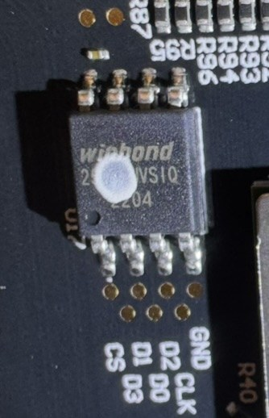
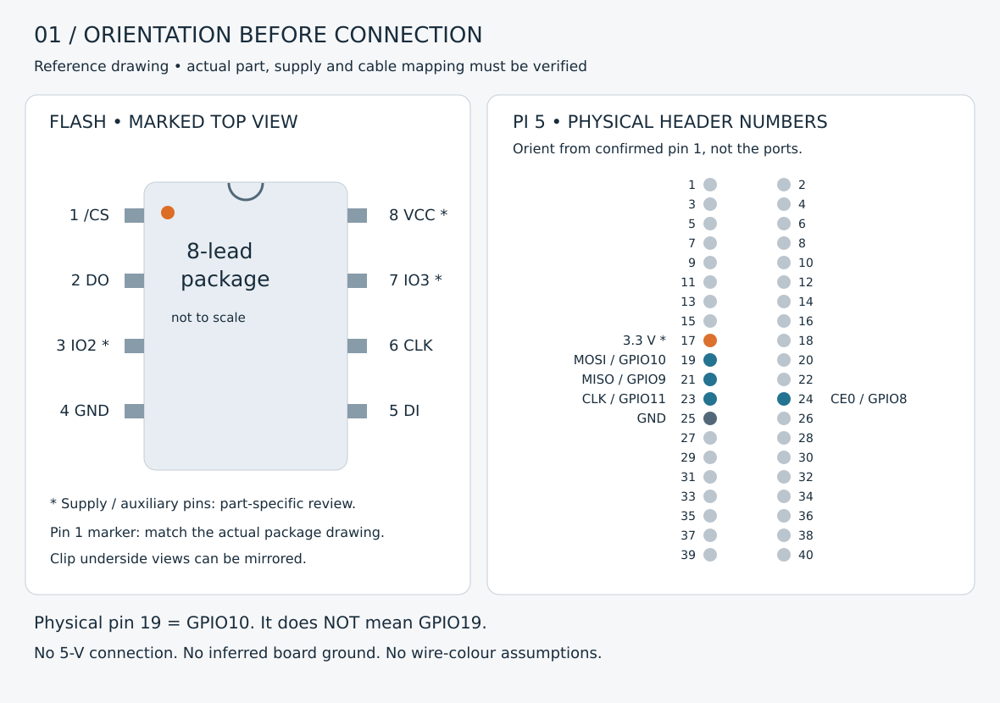
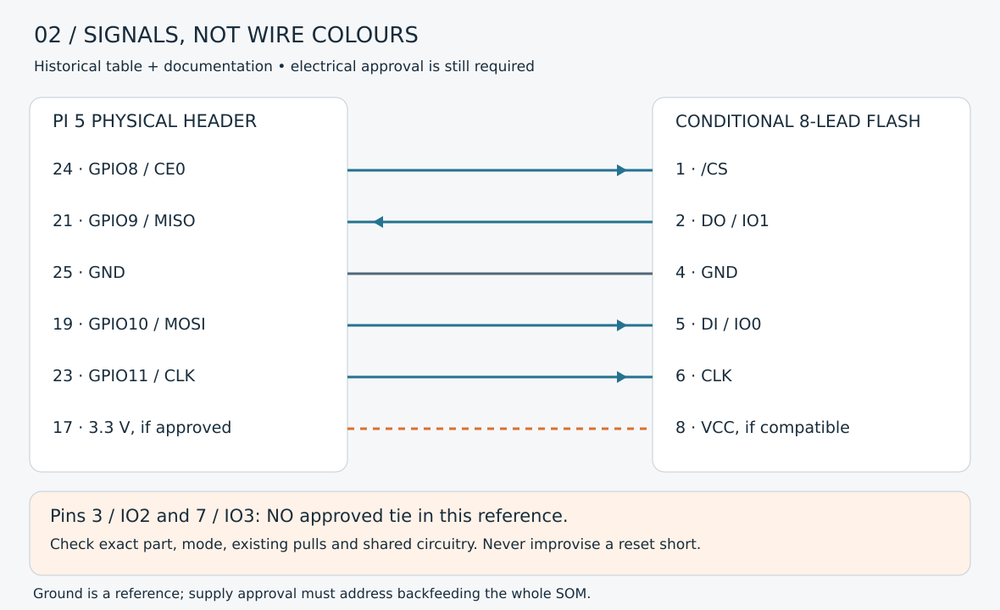

# Pi 5 and the flash clip: identify, map, measure, then read

This is the bench companion to [steps 2–6 of the command walkthrough](COMMAND_WALKTHROUGH.md).
It explains my recorded Pi 5 / SOIC-8 clip route and how to check the connections.
I removed the SOM from my Form 3 and clipped the **still-soldered** flash. I did
not desolder it or attach a soldered UART. This was hardware intervention, not a
software-only unlock. Taking the SOM out does not electrically isolate its flash
from the other components on that module.

**Before connecting:** the full flash marking, package, voltage and shared-board
power arrangement must be known. The surviving closeup does not establish all of
those facts. The table below documents a recorded arrangement and a conditional
signal reference; it is not electrical approval for an unidentified chip.

## What the records establish

| Evidence | What it establishes | What it does not establish |
|---|---|---|
| My deployment-kit guide, sections 4 and 6 | Pi 5, Raspberry Pi OS Lite 64-bit, SOIC-8 clip, SPI0 at `/dev/spidev0.0`, recorded 500 kHz read example and `W25Q32JV` tool selection | An independently readable full ordering code, cable continuity measurements or a safe current budget |
| My closeup below | Eight exposed leads, package orientation features, partly obscured Winbond marking and nearby PCB labels | A complete part identification or electrical continuity of those labels |
| Successful historical acquisition | Matching meaningful 4-MiB reads and subsequent rescue boot on my unit | Safety of a later wiring change or another board revision |
| Pi and Winbond primary documentation | Header signals and the illustrated candidate package's numbering | Identification of the actual installed chip |

The retained deployment-kit archive SHA256 is
`bb323d5a16f0514baf2e215b2c0372657e57ccc75a82b09f6eca89b9d7672ab7`;
its `GUIDE.md` SHA256 is
`92a1dc8a95237305699d2ab5186f4e1b6ca1eae886a5010854e1f98c91298629`.
The private kit is provenance, not a required downloaded firmware input.



*Photo: Mathias Zimmermann; retained closeup without EXIF/GPS. The white spot
obscures part of the marking. The small dark package mark near the lower-left in
this particular photo is an orientation clue, not permission to number leads
without the package drawing. Do not scrape the component to reproduce this guide.*

## 1. Understand the three different sets of numbers

- **Chip pin 1–8:** a position on the flash package, interpreted from its datasheet.
- **Pi physical pin 1–40:** a position on the Pi's two-row header.
- **GPIO number:** the signal name selected by the Pi pin multiplexer, such as
  GPIO10 for SPI0 MOSI. Physical pin19 is GPIO10; it is not GPIO19.

The chip's connections are signal pins, not eight interchangeable positive/negative
terminals. Only VCC and GND are the supply pair. `/CS` selects the chip, CLK clocks
the transfer, DI receives data from the Pi, and DO returns data to it. Thus Pi MOSI
goes to chip DI, while chip DO goes to Pi MISO.

Look **down onto the marked component top**, not from the solder side. For the
illustrated eight-lead package, rotate the drawing so the confirmed pin1 marker
is upper-left: 1–4 run down the left side; 5–8 run up the right. Turning a clip
over mirrors its apparent layout. A red ribbon edge is not proof of pin1.



*Authored reference drawing, not a photograph or scale template. Orange means
"check this reference", not a wire colour. Confirm the Pi's physical pin1 with its
board documentation; do not orient the header by an assumed USB-connector direction.*

## 2. Recorded signal map — conditional on the actual part

The following table reconstructs the kit's signal map, corroborated against the
[Pi hardware documentation](https://www.raspberrypi.com/documentation/computers/raspberry-pi.html#gpio)
and the [Winbond-authored W25Q32JV datasheet, Rev I, Figure 1a / section 3.3](https://media.digikey.com/pdf/Data%20Sheets/Winbond%20PDFs/W25Q32JV_RevI_5-4-21.pdf)
(manufacturer document hosted by DigiKey). It applies to the **illustrated
eight-lead package only**, not a 16-pin or underside-pad variant.

| Flash pin in that drawing | Signal | Pi 5 physical pin | GPIO / action |
|---:|---|---:|---|
| 1 | `/CS` | 24 | GPIO8 / SPI0 CE0 |
| 2 | DO / IO1 | 21 | GPIO9 / SPI0 MISO |
| 3 | IO2; `/WP` depending on variant/mode | **Not assigned here** | Confirm part, existing pull-up and shared circuit before deciding its inactive state |
| 4 | GND | 25 | Common ground; confirm both ends |
| 5 | DI / IO0 | 19 | GPIO10 / SPI0 MOSI |
| 6 | CLK | 23 | GPIO11 / SPI0 SCLK |
| 7 | IO3; HOLD/RESET function depends on variant/mode | **Not assigned here** | Confirm part/mode and shared circuit; no generic RESET short |
| 8 | VCC | 17 **only for an approved 3.3-V setup** | Supply, not a GPIO; shared-rail approval still required |

The older kit described pins3/7 as high **if required by the verified part/circuit**.
It did not retain a measured pull-up/circuit analysis. I cannot turn that conditional
note into a proven instruction to tie both pins directly to VCC. Do not leave a
required input floating, bridge it blindly, change status registers to make a
connection work, or substitute a SoC reset contact. Resolve that part of the circuit
before a read. The diagram deliberately leaves those two connections unresolved.



*Blue: standard SPI signal relationship. Grey: ground reference. Dashed orange:
conditional supply after electrical review. The diagram does not approve backfeeding
the SOM. There is no connection to Pi physical pins2/4 (5 V).*

Winbond's [product selection guide](https://www.winbond.com/export/sites/winbond/product-selection-guide/file/2019-PSG.pdf)
distinguishes W25Q32JV's 2.7–3.6-V family from W25Q32JW's 1.7–1.95-V family. A
shared `W25Q32` prefix or flashrom device choice therefore cannot establish voltage.
An incompatible low-voltage part needs a separately validated programmer/level
interface; this direct Pi reference is not its connection recipe.

## 3. Check the clip before putting it on the board

1. Physically remove printer, Pi, programmer and other cable power. Keep the SOM
   on a stable nonconductive, ESD-appropriate surface. A halted Pi can still power
   header rails; an OS shutdown is not power removal.
2. With the **loose cable disconnected from both boards**, use continuity/ohms to
   map each metal clip jaw to exactly one loose lead. Label the leads C1–C8 after
   confirming how the jaws will sit on the actual numbered chip. Repeat if an
   adapter or extension changes the order.
3. Check for unintended connections between every pair of loose leads, flexing
   the cable gently. The disconnected cable must not contain unexplained shorts.
   This cable-only check is different from measuring a populated PCB.
4. Establish the board's actual GND and VCC contacts from the identified component
   and circuit. First measure residual DC, then use resistance/continuity only when
   de-energized. The closeup's `GND`, `CS`, `D0`–`D3` and `CLK` labels are leads to
   verify, not proof that a nearby pad is connected to the pin you expect.
5. Position the unpowered clip straight over the eight leads. Each jaw must touch
   one lead, not a neighbouring lead or another component. Support the short cable
   so it cannot rotate or pull the clip. Do not push hard enough to bend leads.
6. Recheck **each loose lead to its intended chip lead**, without slipping a probe
   across two leads. Recheck unintended adjacent bridging. If direct probing cannot
   be done reliably, stop rather than scratch or improvise a powered test.
7. Connect the already mapped leads to the **unpowered** Pi only after completing
   the part-specific supply and auxiliary-pin review. Photograph the numbered
   mapping privately; wire colours are supplementary notes only.

## 4. Meter checks with explicit power states

Set the black lead to **COM** and the red lead to the meter's **voltage/ohms input**,
not its current input. Use the meter manual for its range and continuity threshold.
Record actual readings; this guide supplies no invented passing measurements.

| Power state | Meter / exact probe pair after identification | Expected observation and purpose | Stop condition |
|---|---|---|---|
| Everything physically disconnected | DC volts: black flash GND pin4, red VCC pin8 | Residual supply settles to absent within meter resolution; first check before ohms | Sustained/unexplained voltage |
| Fully unpowered, residual checked | Ohms: probes together, then pin4 to independently confirmed circuit ground | Establish lead baseline and genuine ground path | Unknown ground; enclosure/shield merely assumed to be ground |
| Cable alone, both ends disconnected | Continuity: each jaw to its assigned loose lead; then other leads | One-to-one map, no cable shorts | Intermittent/open/wrong conductor |
| Clip fitted, everything unpowered | Continuity: free end C1 to pin1, repeat C2–C8 | Clip actually reaches each assigned lead | Clip movement, bridging, ambiguous measurement |
| Clip off, then fitted; fully unpowered | Ohms: pin8 to pin4, and adjacent chip leads | Compare board baseline with fitted clip; capacitors/shared rails can cause settling or low readings | New unexplained short/path; do not use a universal “safe ohms” cutoff |
| Pi powered alone, **no SOM/clip attached** | DC volts: black Pi physical25, red physical17 | Approximate 3.3 V, within the independently identified part's specified range; verify supply selection | Wrong/unstable voltage or unknown part; never select the 5-V pins |
| Reviewed programmer-only circuit, clip already secure | DC volts: black pin4, red pin8; documented shared-rail points only | Confirm actual loaded supply and assess unexpected board energization | Heat, sag, unknown rail activation or contention: remove programmer power safely |

Do not use current mode across a supply, continuity on powered hardware, a mains
probe point, deliberate discharge shorts or guessed regulator/reset bridges.
Pi GPIO inputs must not receive 5 V. A multimeter does not check SPI waveform
quality. Three equal reads establish repeatability/content, not power safety.
[flashrom's in-system guidance](https://raw.githubusercontent.com/flashrom/flashrom/main/doc/user_docs/in_system.rst)
explains why shared power and an attached controller can interfere with a clip.
This guide does not prescribe simultaneous printer and programmer power.

## 5. Prepare the Pi 5 while it is disconnected from the SOM

These are **examples for the Pi**, not commands run by repository tests. Install
the packages in walkthrough step2. With no flash or clip attached:

```sh
# PI — local configuration only; flash/SOM must be physically disconnected.
cat /proc/device-tree/model
printf '\n'
sudo raspi-config nonint do_spi 0
ls -l /dev/spidev*
flashrom --version
```

`do_spi 0` enables SPI; it changes Pi configuration. See the
[official raspi-config SPI option](https://www.raspberrypi.com/documentation/computers/configuration.html#spi).
If the installed OS asks for a restart, restart the **Pi alone** before any wiring.
Do not replace a missing SPI node with a guessed one or use legacy direct-register
GPIO examples for the Pi 5's RP1. The documented reference used `/dev/spidev0.0`
(SPI0 CE0); inspect the actual OS configuration to establish your node.

Before fitting/changing wires, shut the Pi down and remove its supply physically.
The Pi power supply is only restored after all unpowered checks and the in-circuit
power decision have passed; printer power remains disconnected.

The archived read used `linux_spi:dev=/dev/spidev0.0,spispeed=500` and flashrom's
`W25Q32JV` definition. This is **historical configuration, not a default that the
build scripts silently select**. `spispeed` is in kHz. Reuse it only when actual
chip/controller/wiring review supports it. The [flashrom Pi instructions](https://raw.githubusercontent.com/flashrom/flashrom/main/doc/user_docs/raspberry_pi.rst)
describe the programmer syntax. No read/write command belongs before that review.

## 6. Continue only when the physical record is complete

Save the full marking/package, datasheet revision, numbered wire map, supply and
continuity measurements, Pi/flashrom versions and any abnormal result privately.
The current unresolved evidence is specific: readable full marking, actual
pins3/7 treatment, and the shared-rail measurement/power arrangement. A new
arbitrary chip dump will not resolve those physical questions.

Continue with [three independent reads](COMMAND_WALKTHROUGH.md#3-physical--pi--identify-the-chip-and-acquire-three-reads),
then image validation, separately approved writing and full readback. On mismatch,
retain every file and stop before printer power. Do not move a powered clip.
Before reassembly, remove **all** Pi/clip conductors and programmer power; restore
the SOM and its original heatspreader/contact arrangement. This chapter adds no
new measurement, successful hardware operation or universal compatibility claim.
