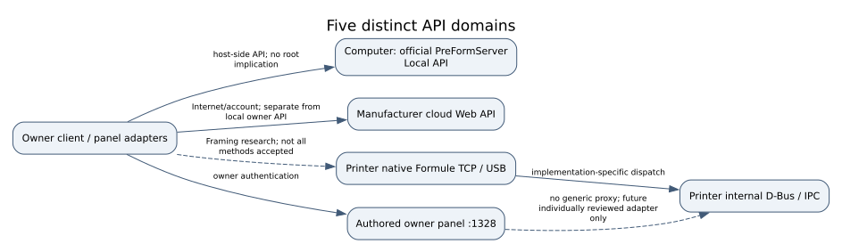
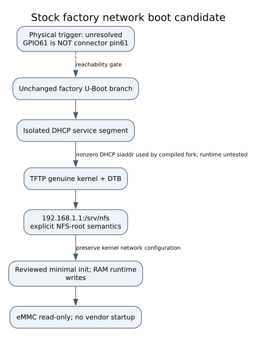
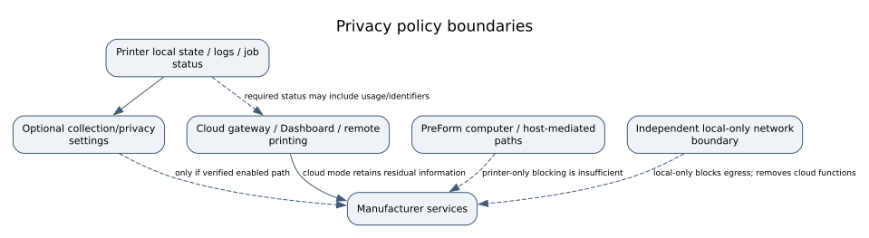

# Research boundaries and diagram appendix

These diagrams explain concepts that are not extra installation steps. Dashed
arrows denote candidates, uncertain reachability or conditional flows; they are
not hardware acceptance. Source and evidence limits remain in
[Evidence status](EVIDENCE_STATUS.md). All figures are authored; vendor artwork
and firmware are not embedded.

## API domains



*Architecture / research: PreFormServer on a computer, cloud Web API, printer
Formule TCP/USB, internal IPC and the owner panel are distinct interfaces. A
Formule listener was retained in the panel receipt; that does not validate every
native method. Existing bounded [Formule framing code](../../owner-ui/formule_codec.py)
and [panel adapters](../../owner-ui/panel_data.py) must be read by method, not by
assuming every Get call is side-effect free. No generic privileged IPC proxy.*

## Experimental factory network boot



*Historical static candidate only. The physical trigger and stock-device boot/shell
remain unconfirmed. GPIO numbering is not connector numbering. The literal NFS
address shown belongs to the recovered path, not a recommended home-router
configuration. Use a genuinely isolated service segment for any future separately
reviewed experiment. This source guide supplies no executable stock-root shortcut.*

## Privacy and cloud



*Conceptual dependency boundary, not a proven per-field cloud policy. Disabling an
optional preference does not prove that required status carries no identifiers or
consumption. Printer isolation does not isolate PreForm's computer. The panel's
privacy selector is a preview/preferences feature, not verified vendor mutation.
Local logging and support-archive decryption are separate questions.*

## Figure sources and reproducibility

The numbered `.dot` files in [figures](../figures/) are the rendering sources;
matching `.mmd` files are editable Mermaid equivalents. Run:

```sh
# LAPTOP — authored vector regeneration only; Graphviz must be installed.
python3 tools/render_public_figures.py
```

Every SVG has a title/description. The checker rejects active/external SVG content
and unembedded numbered figures. Captions declare scope rather than turning an
architecture arrow into an observed hardware result. No drawing supplies missing
voltage, pin identification, physical measurements or acceptance.
