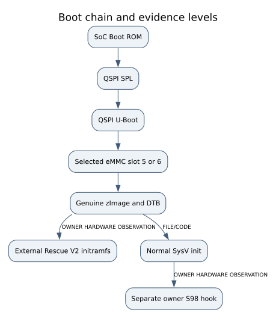
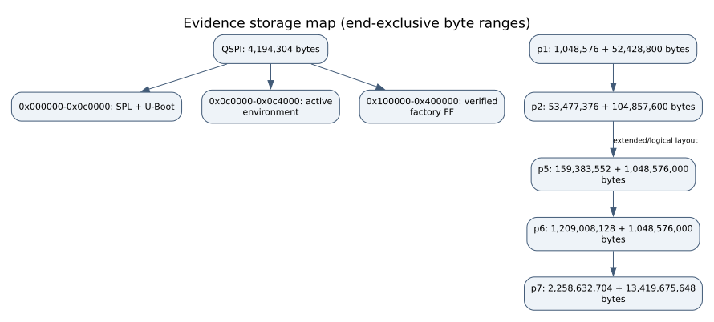
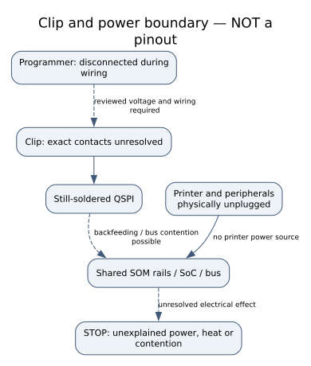
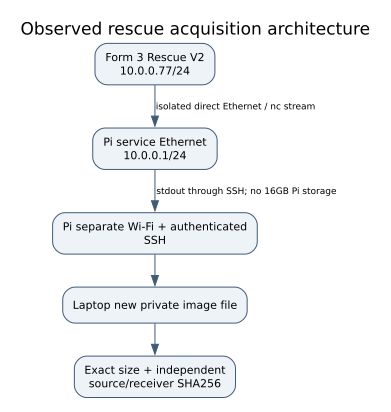

# Root access, electrical checks and acquisition

For commands in chronological order, use the [command walkthrough](COMMAND_WALKTHROUGH.md).
This chapter provides the electrical/architecture explanation and the additional-device profile gate.

**Tutorial route:** this chapter → [first persistent installation](OWNER_INSTALL.md)
→ [secure root SSH, SFTP and daily login](SECURE_SSH.md). Read the three chapters
before the first write. They describe one chronological route, not three alternative
installers. The source-only build/test entry is [BUILD](BUILD.md).

| Milestone | What I have afterward | Required saved proof |
|---|---|---|
| Identify and read my QSPI | My own unmodified boot backup | Part/power measurements, three reads, sizes/hashes/CRCs |
| Build and deliberately boot rescue | Temporary root **in RAM** | Unchanged bootloader code, reviewed image diff, full flash readback |
| Acquire eMMC and boot areas | Recovery evidence before persistent changes | Source/receiver sizes and SHA256, failed reads retained |
| Plan/install owner services | Separate owner startup and authorization files | Exact device/slot/version, signatures, before/after files and transaction |
| Return to my original QSPI | Normal manufacturer boot with owner services | My original hash plus new complete readback |
| Enroll and test SSH | Authenticated root access, reusable key, file exchange | Independently established host pin; rejection and SFTP tests |

An already rooted printer starts at its applicable milestone. Do not repeat a
hardware flash for a panel update. Another printer with an unmatched factory hash
stops at the profile-engineering gate in section 4; that remaining work is explicit.

**Audience:** experienced owners with Linux, SSH, SPI/electrical verification and
recovery skills. Rooting is hardware intervention, not an ordinary panel update.
This guide describes the demonstrated reference route and explicitly separates
steps still requiring board-specific verification. No command in the build/test
path accesses a printer, programmer or Pi.

I opened my Form 3, removed its SOM and used a clip on the still-soldered QSPI chip.
I did not remove the flash or solder UART. The prior route into the boot chain is
credited in [rights and credits](RIGHTS_AND_RELEASE.md). I do not claim that these
observations certify a different board, flash suffix or programmer arrangement.

## 1. Understand the boot and storage boundaries



*FILE/CODE and historical hardware observation: genuine boot components are retained;
the rescue boot environment chooses an external RAM userspace.*

| Reference QSPI range, end exclusive | Role | Rescue change |
|---|---|---|
| `0x000000–0x040000` | SPL/MLO | None |
| `0x040000–0x0c0000` | U-Boot | None |
| `0x0c0000–0x100000` | Environment partition | Only the active CRC-protected `0x4000` bytes |
| `0x100000–0x400000` | Verified factory FF region | Compressed initramfs at its beginning; trailing FF preserved |

The active environment selects genuine eMMC kernel/DTB, including the existing
load fallbacks. `silent` is deleted, the exact payload length is inserted and CRC32
is recalculated. The raw-initrd bootz syntax and relevant parser are pinned to the
inspected bootloader. CRC is an integrity check, not a manufacturer signature.
The builder preserves all bytes outside the environment/payload regions and outputs
an exact changed-byte report. No factory image is included in this release.



*Reference layout: p1 identity/configuration; p2 metrics; p5/p6 A/B OS slots; p7 data.
p3 is the extended-partition container. Slot roles are selected by current state,
not permanent “main”/“recovery” labels. Initial owner installation supports only
selected p6, 2.5.6-2773 and no pending boot flip. p5 is initially left untouched.*

## 2. PHYSICAL: resolve the electrical gate before connecting a clip

Use the illustrated [Pi 5 / clip companion](PI5_CLIP_GUIDE.md) for top-view pin
numbering, the recorded connection table, cable mapping and exact meter probes.
It separates a conditional signal reference from approval for the actual board.

Required: complete legible flash marking/package and orientation, its exact
datasheet, actual programmer/Pi model, confirmed board ground/supply contacts,
multimeter, stable bench and an independent protected backup location. The available
closeups did not establish the complete suffix or shared-rail behavior. A previous
flashrom `-c` choice is not part identification. **No board-specific flash wiring/write profile is approved until these facts are resolved.**
The walkthrough shows conditional manual CLI shapes; typed acknowledgements cannot replace measurements.

Consult [flashrom in-system guidance](https://www.flashrom.org/user_docs/in_system.html),
[Pi programmer guidance](https://www.flashrom.org/user_docs/raspberry_pi.html),
[official Pi header documentation](https://www.raspberrypi.com/documentation/computers/raspberry-pi.html)
and the [Winbond datasheet index](https://winbond.com/hq/support/documentation/?__locale=en).
Use the identified part's datasheet; do not generalize a candidate part's voltage
or IO2/IO3/WP/HOLD/RESET requirements to an unread suffix. Physical header position
and BCM GPIO number are different. Wire color is not a contact identity.

`G` below is a **confirmed** circuit ground; `V` the confirmed flash supply contact;
`C<n>` an identified chip/clip contact. These symbols are not an inferred physical
pinout. Record the actual meter, probe locations, readings and power state privately.

| Power state | Meter mode and probe points | Expected/source and purpose | Stop condition |
|---|---|---|---|
| All power/cables physically removed | DC volts: black G, red V | Residual supply absent within meter resolution after settling; establish de-energized state | Persistent/unexplained voltage |
| Fully disconnected, residual voltage absent | Ohms/continuity: leads together, then G to independently confirmed circuit ground | Lead baseline and consistent ground path supported by circuit/part documentation | Unknown ground; a chassis/shield alone is not proof |
| Fully disconnected | Ohms/continuity: disconnected programmer conductor to intended C<n> | One-to-one mapping from actual cable and package; verifies contact | Unstable, swapped or unidentified contact |
| Fully disconnected | Ohms/continuity: each adjacent identified clip contact pair | No unintended cable/clip short; distinguish designed board connections | Unexpected short or unexplained path |
| Fully disconnected | Ohms: V to G, both polarities if needed | Document actual settling/capacitor/shared-rail behavior; no universal safe resistance threshold | Unexplained low reading or inability to distinguish board behavior from a short |
| Programmer powered alone, disconnected from SOM | DC volts: confirmed supply output to programmer ground | Actual value inside identified part/programmer limits | Unknown voltage variant, unstable output or incorrect header contact |
| Only after a reviewed in-circuit power plan | DC volts at documented shared-rail points and V/G | Check unexpected board energization/backfeeding/contention | Heat, unexplained rail activation or bus contention; remove programmer power safely |
| All power removed after read/write operations | Visual assembly check | All programmer wires removed, SOM/heatspreader seating restored | Damage, remaining wires or uncertain seating |

OS poweroff is not physical power removal. Never measure continuity/resistance on
powered hardware, place current mode across supply rails, probe mains, short rails
to discharge them or bridge unverified SoC/reset pins. No simultaneous printer and
programmer power is specified here. Equal reads do not prove electrical safety;
a multimeter does not validate SPI timing. Resolve an in-circuit isolation problem
before continuing instead of raising voltage or guessing reset connections.



*Logical power domains, not a verified connector pinout. The separately editable
measurement diagram is `docs/figures/04-measurement-points.mmd`.*

## 3. PI/PHYSICAL then LAPTOP: preserve three meaningful reads

After the preceding gate, review the exact programmer/part/read-only command from
its primary documentation. Acquire three separate full reads to **new files**, with
independently re-established contact as appropriate. Preserve full logs, tool version,
frequency, wiring/power notes and failed reads. Do not substitute three copies of one
read. The following tool analyzes files only:

```sh
# LAPTOP — existing preserved regular files; guarded variables cannot run unset.
: "${READ1:?first independent full read}"
: "${READ2:?second independent full read}"
: "${READ3:?third independent full read}"
: "${READ_REPORT:?new local JSON report path}"
python3 tools/inspect_qspi_reads.py --read "$READ1" --read "$READ2" \
  --read "$READ3" --output "$READ_REPORT"
```

Expected: three distinct inodes, 4,194,304 bytes each, identical content, bounded SPL
header, U-Boot header/payload CRCs, active environment CRC and nonblank boot regions.
The report contains hashes, not private environment contents. Preserve read-only
originals plus an independent backup. This establishes agreement/structure of the
inputs; it cannot prove electrical acquisition or ownership.

## 4. A different factory hash: profile engineering, not pin removal

The reference factory hash is
`8a09d540d683c96227b875be1462bb0e6f9ab1ee4d0717be787e3cd1dcb4fedf`.
A different device can legitimately have a different environment and therefore a
different whole-image hash. The current builder **refuses** such an input. Do not
borrow my image or edit a constant merely to bypass the failure.

A new profile needs a review branch and these concrete artifacts:

1. Independent three-read receipt, exact size/hash and identified hardware/geometry.
2. Local read-only partition/header analysis; validate environment location, extent,
   endianness, CRC and duplicates/termination with `rescue_common.parse_env`.
3. Compare SPL/U-Boot hashes and map the relevant load/sf/mmc/bootz implementation.
   Changed code requires supported-syntax/control-flow analysis, not only strings.
4. Recover that device's existing kernel/DTB loading/fallbacks, current slot, memory
   addresses and arguments. Preserve identity/calibration and never publish raw env.
5. Verify the **whole** candidate payload region is FF and prove no other content
   is changed. Bind all expected data in a new explicit profile with its own hashes.
6. Add positive and negative tests for that profile: input corruption, wrong CRC,
   non-FF payload, wrong slot, payload overflow, exact allowed diff ranges and
   unchanged SPL/U-Boot. Do not relax the reference tests.
7. Reproduce images twice, compare complete artifacts and have the physical write/
   readback/recovery plan independently reviewed before a supervised target boot.

This is a specification for additional engineering, **not an already implemented
universal profile importer**. A hash-only difference does not by itself prove all
underlying conditions. An experienced developer can inspect the supplied builder
and add a reviewed profile without needing any private key from this project.

## 5. LAPTOP: build the supported reference rescue

Follow [host setup](BUILD.md) and provide your own matching authenticated input.
The `--factory` option reads it in place; evidence does not need to be moved into
the clone. No downloads happen if authentication fails.

```sh
# LAPTOP — source build only, new ignored outputs. Inputs must match the reviewed profile.
: "${FACTORY_COPY:?path to authenticated matching local factory file}"
python3 tools/build_rescue.py --factory "$FACTORY_COPY" --offline \
  --output-dir build/rescue-v2
python3 tools/build_qspi_rescue.py --factory "$FACTORY_COPY" \
  --initramfs build/rescue-v2/form3-rescue.cpio.gz --output-dir build/qspi-review
```

Expected: static ARMv7 BusyBox verified with file/readelf; newc+gzip payload under
3 MiB, genuine boot chain preserved, valid environment CRCs and exact 4 MiB output.
The local report lists changed regions and hashes. Preserve it privately: generated
environment reports can contain device data. No build or test flashes hardware.

## 6. PI/PHYSICAL: deliberate write and complete readback

This is a separately gated step, blocked while part/voltage/pinout/erase geometry
remain unresolved. Review the exact device, source hash, operation and power-loss
recovery. Write only the reviewed rescue image, then acquire a **new full readback**
and compare every byte/hash before printer power-on. Preserve pre-read/source/readback
and logs. Mismatch means stop, not try booting. Remove all programmer power/wiring
before reassembly. No automated internal MTD restore or guessed programmer setting is supplied.
The [walkthrough](COMMAND_WALKTHROUGH.md) gives the manual flashrom command shape
only after the identified-part and measured-power gate.

## 7. PI/RESCUE: isolated shell and read-only backup



*Reference rescue uses printer `10.0.0.77/24` and service Pi `10.0.0.1/24`, no gateway.
These are deliberate rescue protocol defaults, not normal printer WLAN addresses.
The Pi's Wi-Fi management must not forward/bridge that segment to other networks.*

`scripts/pi_rescue_link_setup.sh` prints usage and refuses without `--apply`; it
does not have a dry-run plan subcommand. Review its source and `--apply` separately;
inspect actual routes, forwarding and bridges before target contact. The raw shell
is unauthenticated and must remain on the physically isolated cable.

```sh
# PI — only on the reviewed isolated link. No prompt/local echo may be visible.
nc 10.0.0.77 2324
```

Then, **inside that connected terminal**:

```sh
# RESCUE — identify before any further operation.
printf 'FORM3-RESCUE-IDENTITY\n'
id
uname -a
cat /proc/cmdline
blockdev --getro /dev/mmcblk0
blockdev --getsize64 /dev/mmcblk0
cat /proc/partitions
cat /proc/mounts
```

Expected: root UID, ARMv7, `rdinit=/init`, software read-only `1`, reference user area
15,678,308,352 bytes and no eMMC filesystem mounted. A Pi hostname/wrong architecture,
missing marker or wrong size is a stop. `exit` returns to the Pi terminal.
Do not assume V2 has Python/tar/chmod/cp/grep; inspect BusyBox applets first.

Start the receiver on LAPTOP before sending:

```sh
# LAPTOP — trusted existing Pi SSH alias, new image basename and exact size.
: "${FORM3_PI_SSH:?already authenticated Pi SSH alias}"
: "${ACQUISITION_NAME:?new basename ending .img}"
: "${EXPECTED_BYTES:?exact blockdev byte count}"
export FORM3_PI_SSH
bash scripts/receive_emmc_via_pi.sh "$ACQUISITION_NAME" "$EXPECTED_BYTES"
```

`rescue/rootfs/bin/form3-backup` supports only the user area and boot0/boot1, hashes
the same source stream and rejects RPMB. Its reference BusyBox tee pipeline was slow;
the demonstrated faster alternative was direct `dd -> nc` plus an independently
recorded source SHA256 in the same unchanged rescue window. Review source device,
byte count, read-only flag and receiver readiness before transfer. Neither operation
mounts a filesystem. Stop/preserve partial outputs on timeout; never overwrite them.
The laptop receives via SSH stdout, so the Pi need not store the 16 GB image.

Source/device and receiver hashes **and** byte counts must agree. The boot areas
were each 4,194,304 bytes and identical in the reference acquisition. No fsck, journal
replay, write test, RPMB, EXT_CSD or provisioning is part of acquisition. At this
point, proceed to [installation](OWNER_INSTALL.md), not a whole-eMMC restore.

### The sender side, one device at a time

For each row start a **new** receiver invocation on LAPTOP first, with a distinct
`.img` basename and the exact measured byte count. Wait for its listener-ready
message, then run the corresponding command in the identified RESCUE shell:

| Image | RESCUE command | Reference size, not a substitute for measurement |
|---|---|---|
| Complete eMMC user area | `form3-backup /dev/mmcblk0 10.0.0.1 9000` | 15,678,308,352 bytes |
| Boot area 0 | `form3-backup /dev/mmcblk0boot0 10.0.0.1 9000` | 4,194,304 bytes |
| Boot area 1 | `form3-backup /dev/mmcblk0boot1 10.0.0.1 9000` | 4,194,304 bytes |

Before each transfer require `blockdev --getro DEVICE` to print `1`, use
`blockdev --getsize64 DEVICE`, and check that no eMMC filesystem is mounted. Here
`DEVICE` means the literal device from that row, not an unreviewed wildcard.
The commands read raw blocks; the internal hash covers the same byte stream sent
to the receiver. No filesystem is needed and RPMB is not part of the list.

Save the sender's `Source stream complete`, byte count and SHA256 alongside the
receiver receipt. If either side is short, exits unsuccessfully or differs, retain
the failed image and retry only to a **new** filename after understanding why.
Receiver `.incomplete` removal means its transfer/length checks completed; when no
expected source hash was supplied, independent hash comparison is still pending.
The two boot areas being equal on this printer does not justify skipping either
acquisition on another printer. Make an independent backup before installation.

## Continue to normal owner access

Temporary root ends with rescue. Use [installation](OWNER_INSTALL.md) to inspect
the current selected slot/journal, prepare your independent package signer/client
key, review the p6/p7 file plan, and restore your original QSPI after verification.
Then use [secure SSH](SECURE_SSH.md) for first host trust, public-key-only root,
negative authentication checks, SFTP and a reusable daily profile. Keeping root
does not require leaving the unauthenticated rescue shell exposed on a home LAN.
