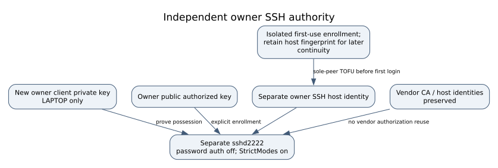

# From the first normal boot to convenient, authenticated root SSH

This is the final chapter of the [root/acquisition tutorial](ROOT_GUIDE.md) and
[transactional installation](OWNER_INSTALL.md). I use a separate owner SSH server
on **2222**, with my own client key and the printer's own separate owner host key.
Daily use can be one command. No manufacturer key, shared password, passwordless
network shell or repeated QSPI programming is needed for ordinary access.

**Scope:** the reviewed Form 3 / p6 / firmware 2.5.6-2773 installation. Root access
and historical normal-device SSH acceptance are established for the reference
device; compatibility with another board/release must be checked. The server is
vendor OpenSSH 7.5p1 on an old platform. Restricted exposure and key authentication
reduce risk; they do not turn that platform into a supported modern OS.

## 1. Know which identity you are checking

| Item | Where its private half belongs | What it authorizes |
|---|---|---|
| Named Ed25519 **client** key | My laptop, preferably passphrase protected | My root login to the separate owner server |
| Ed25519 owner **host** key | Printer's `/data/owner-maintenance/ssh/host_ed25519` | The server identity my laptop must recognize |
| RSA package signer | My private laptop/offline storage | Reviewed owner installation/update packages |
| Panel certificate and access secret | Reviewed private panel identity storage | HTTPS identity and panel access; independent of SSH |

The public signer PEM hash is a SHA256 of file bytes. SSH fingerprints are the
`SHA256:…` representation printed by `ssh-keygen`. They are different formats and
different trust decisions. A listening port or a vendor public key is not a way to
authenticate as root. Do not copy any printer's identity or a fixture private key.



*The first server-key enrollment requires an independently isolated physical link.
Later connections use the retained key, including when DHCP changes the address.*

## 2. Before the first normal boot

Finish the installation's verified file transaction and retain rollback records.
Restore **this printer's own original QSPI**, using the separate electrical and
complete-readback gate. Normal owner SSH cannot be tested while the printer is
still running the minimal Rescue V2 userspace. Do not run vendor init from rescue
as a shortcut, and do not require normal SSH to perform the first installation.

The initial configuration selects `eth0`, the reviewed narrow client range, and
`panel_enabled=false`. Normal ConnMan boot needs a DHCP source; it does not inherit
rescue's static address. Prepare the independently isolated service link **before**
booting. Check Ethernet, stored WLAN associations, IPv6, USB, bridges and host
forwarding; one isolated cable does not isolate a still-associated Wi-Fi radio.

Use the dedicated laptop Ethernet topology or a separately reviewed Pi service
link. When the Pi acts as an SSH jump host, the printer sees the Pi's service-side
source address: that address must fall within the owner SSH client allowlist.
Keep the Pi management identity pinned too. Do not broaden the printer firewall
to the entire home network just to hide a routing mistake. No DHCP/router/network
configuration is executed by this tutorial or its tests.

**Stop** if sole-peer topology, current DHCP lease, device correlation, supported
firmware or completed installation cannot be established. A normal boot writes
vendor logs/state; it is not a read-only forensic operation.

## 3. LAPTOP: enroll the first server key on the isolated link

Keep the private directory and client key created in [installation](OWNER_INSTALL.md).
Set the current IPv4 address from the isolated lease record. Values below are
variables, not the address of my printer. Commands are run from a Bash laptop shell.

```sh
# LAPTOP — only after independent physical isolation and device correlation.
: "${OWNER_PRIVATE:?existing private owner deployment directory}"
: "${PRINTER_HOST:?current verified isolated printer IPv4 address}"
: "${OWNER_KEY:?existing named owner private client key}"
export OWNER_PRIVATE PRINTER_HOST OWNER_KEY
OWNER_PIN_CANDIDATE="$OWNER_PRIVATE/host-key-candidate.txt"
export OWNER_PIN_CANDIDATE
(umask 077; set -C; ssh-keyscan -T 5 -p 2222 -t ed25519 \
    "$PRINTER_HOST" > "$OWNER_PIN_CANDIDATE")
ssh-keygen -lf "$OWNER_PIN_CANDIDATE" -E sha256
```

Expected: exactly one Ed25519 server public key, not an empty file or several
different identities. Record its fingerprint privately and correlate the sole peer
with the acquisition/rescue record. `ssh-keyscan` **does not authenticate** a server.
This first enrollment relies on the independently verified isolated topology.
For an existing installation, require the previously retained fingerprint instead;
an unexplained change is a stop, not a fresh enrollment opportunity.

## 4. LAPTOP: save a strict profile, including a stable key alias

Only after the preceding key review, the following local step creates two **new**
files. It validates the complete Ed25519 public-key encoding and the independently retained
fingerprint, refuses existing files, uses a stable `HostKeyAlias` and does not connect
to the printer. For the Pi topology, add `--jump-alias form3-pi` only when that alias already
exists in the laptop default SSH configuration and its Pi host key is pinned.
The generated ProxyCommand retains strict Pi host checks and forwards no agent.
The alias pins a key independently of a DHCP address. It does not
turn a local name into authenticated network discovery.

```sh
# LAPTOP — local profile creation; uses the reviewed variables from step 3.
umask 077
# Set this from the independently reviewed fingerprint in step 3.
: "${OWNER_HOST_FINGERPRINT:?reviewed SHA256:... host fingerprint}"
python3 tools/create_owner_ssh_profile.py \
  --directory "$OWNER_PRIVATE" --host "$PRINTER_HOST" --key "$OWNER_KEY" \
  --candidate "$OWNER_PIN_CANDIDATE" \
  --expected-host-fingerprint "$OWNER_HOST_FINGERPRINT"
export OWNER_SSH_PROFILE="$OWNER_PRIVATE/owner-ssh.conf"
ssh-keygen -lf "$OWNER_PRIVATE/owner-known-hosts" -E sha256
ssh -G -F "$OWNER_SSH_PROFILE" form3-owner
```

Compare the displayed fingerprint with step 3. `ssh -G` prints effective client
configuration without connecting: root, port 2222, the named IdentityFile, pinned
known-hosts file and strict checking must match. Keep this configuration private;
it contains local paths and addressing even though it contains no private key.
For a Pi topology, add only the reviewed jump-host configuration; do not copy a
sample ProxyCommand containing somebody else's IP or disable either host-key check.

## 5. LAPTOP → NORMAL PRINTER: first authenticated shell

```sh
# LAPTOP — the reviewed alias identifies the separate owner service.
: "${OWNER_SSH_PROFILE:?strict local profile from step 4}"
ssh -F "$OWNER_SSH_PROFILE" form3-owner
```

The prompt may not look distinctive. In that shell, identify the execution context:

```sh
# NORMAL PRINTER — read-only checks, not a printing or reboot command.
id
uname -a
cat /proc/cmdline
cat /etc/formlabs/version.json
ownerctl verify --context normal --slot-root / --data-root /data
ssh-keygen -lf /data/owner-maintenance/ssh/host_ed25519.pub -E sha256
```

Expected: UID 0, ARMv7 / genuine Linux 4.9.65+, normal root p6 without `rdinit=/init`,
firmware 2.5.6-2773, successful owner verification and the same host-key fingerprint.
Keep identifiers/private receipts off Git. Matching the fingerprint from inside
this first session checks continuity; the initial independent trust was physical.

Open a second laptop terminal and repeat the same SSH command while retaining the
first session. Exit/reconnect one session. The panel may still be disabled: SSH is
independent. Do not weaken root account locking, edit shadow or import a vendor CA.
The actual `bootstrap.py::ssh_configuration` uses publickey-only authentication,
`PermitRootLogin prohibit-password`, separate authorization/host files and
`internal-sftp`; ordinary forwarding is disabled.

## 6. Acceptance: reject wrong credentials and test SFTP

Test wrong-key rejection with a new, temporary **test** key, never the package
signer or another printer's key. Keep the working session open. A test that fails
because of a timeout or host-key mismatch does not establish authentication rejection.

```sh
# LAPTOP — local throwaway key, followed by one negative login attempt.
: "${OWNER_PRIVATE:?existing private directory}"
: "${OWNER_SSH_PROFILE:?verified profile}"
REJECTION_DIR=$(mktemp -d "$OWNER_PRIVATE/ssh-rejection.XXXXXX")
ssh-keygen -q -t ed25519 -N '' -f "$REJECTION_DIR/wrong-key"
ssh -F /dev/null -p 2222 -i "$REJECTION_DIR/wrong-key" \
    -o BatchMode=yes -o IdentityAgent=none -o IdentitiesOnly=yes \
    -o HostKeyAlias=form3-owner -o HostKeyAlgorithms=ssh-ed25519 \
    -o StrictHostKeyChecking=yes -o GlobalKnownHostsFile=/dev/null \
    -o UserKnownHostsFile="$OWNER_PRIVATE/owner-known-hosts" \
    -o PasswordAuthentication=no -o KbdInteractiveAuthentication=no \
    -o ConnectTimeout=8 "root@$PRINTER_HOST" true
```

This direct-link test deliberately uses `-F /dev/null` and `IdentityAgent=none` so
OpenSSH cannot also offer the correct profile/agent key. For an approved Pi jump
topology, add that independently pinned jump route explicitly. Expected
outcome is authentication refusal (`Permission denied (publickey)`), while the
original profile still connects. Never put the throwaway key in authorized_keys.
Password and keyboard-interactive login must also remain unavailable; a root
password prompt is a configuration discrepancy, not an invitation to set one.

For file exchange:

```sh
# LAPTOP — public-key authentication and the same server identity.
sftp -F "$OWNER_SSH_PROFILE" form3-owner
```

Inside SFTP use `pwd`, `ls`, `put`, `get` and `bye`. For a bounded automated first
roundtrip after the preceding identity checks, use this laptop Bash block:

```sh
# LAPTOP — creates one new RAM directory on the authenticated NORMAL PRINTER.
LOCAL_CHECK=$(mktemp -d "$OWNER_PRIVATE/sftp-check.XXXXXX")
printf 'OWNER SFTP ROUNDTRIP\n' > "$LOCAL_CHECK/sent.txt"
REMOTE_CHECK=$(ssh -F "$OWNER_SSH_PROFILE" form3-owner \
    'umask 077; mktemp -d /run/owner-sftp.XXXXXX')
[[ "$REMOTE_CHECK" =~ ^/run/owner-sftp\.[A-Za-z0-9]{6}$ ]] || \
    { printf 'STOP: unexpected remote test directory\n'; exit 1; }
sftp -b - -F "$OWNER_SSH_PROFILE" form3-owner <<SFTP
put "$LOCAL_CHECK/sent.txt" "$REMOTE_CHECK/probe.txt"
get "$REMOTE_CHECK/probe.txt" "$LOCAL_CHECK/received.txt"
bye
SFTP
cmp -- "$LOCAL_CHECK/sent.txt" "$LOCAL_CHECK/received.txt"
sha256sum "$LOCAL_CHECK/sent.txt" "$LOCAL_CHECK/received.txt"
ssh -F "$OWNER_SSH_PROFILE" form3-owner \
    "sha256sum '$REMOTE_CHECK/probe.txt'; wc -c < '$REMOTE_CHECK/probe.txt'"
```

Expected: three matching SHA256 values and 21 bytes; `cmp` succeeds without output.
Preserve failed transfers rather than retrying over them. The new RAM directory can
remain until the next supervised reboot or be removed explicitly after verification.
No vendor file is overwritten. `sftp` exercises the configured subsystem directly.
This test proves authenticated transfer, not storage backup or print correctness.

## 7. Daily login without repeatedly typing a passphrase

Keep one reusable client key. If the desktop already supplies `SSH_AUTH_SOCK`, use
that agent. Otherwise start a local agent in the current terminal:

```sh
# LAPTOP — skip the agent-start line if a trusted desktop agent is already active.
eval "$(ssh-agent -s)"
ssh-add -t 8h "$OWNER_KEY"
ssh -F "$OWNER_SSH_PROFILE" form3-owner
```

The key is unlocked locally for the bounded agent lifetime; there is no printer
password to enter. **Password-free convenience is not unauthenticated root.** Keep
the encrypted client key backed up privately. Do not forward the agent to the
printer. Panel login preferences have no effect on SSH authentication.

## 8. DHCP/WLAN, panel and rollback

After isolated acceptance, use the installation's separately reviewed network
transaction if owner WLAN access is desired. DHCP must keep working. Update only
the laptop profile's HostName to the newly verified address/local DNS name; retain
HostKeyAlias, IdentityFile and the server pin. A new key is not expected after
an address change. Do not rely on an unverified mDNS name or scan unrelated LANs.

The Pi is unnecessary for daily **direct WLAN SSH only after** that interface,
firewall, address-change handling and reboot persistence have passed acceptance.
Keep the wired rescue/SSH route available through the first transition. HTTPS panel
enrollment has its own key/certificate and current-address SAN. Do not disable TLS
verification or treat optional WLAN HTTP as encrypted transport.

| Problem | First action | Do not do |
|---|---|---|
| Address changed | Verify DHCP/local name; keep the same host pin | Delete known_hosts or accept an unexplained key |
| Key denied | Check selected client public fingerprint and owner authorization | Set an empty root password or edit vendor identity |
| Panel down, SSH works | Inspect owner status; review certificate/owner transaction | Reflash QSPI or stop printing/safety services |
| Interrupted owner update | Preserve pending/latest transaction; use matched rollback | Retry apply with invented hashes or erase transaction history |
| Vendor firmware/slot changed | Stop at compatibility refusal; use retained recovery route | Automatically patch both slots or remove version checks |
| No owner access | Review original QSPI/rescue and private rollback records | Restore somebody else's dump or blindly rewrite all eMMC |

For exact package-update and rollback commands return to [installation, section 6](OWNER_INSTALL.md#6-ordinary-updates-disable-and-recovery).
An owner panel update does not normally require another hardware flash. Persistent
p7 files alone do not prove the p6 startup hook survives a manufacturer A/B update.
The raw rescue ports must not become ordinary LAN root services.

## Primary references and implementation checks

- [OpenSSH client configuration](https://man.openbsd.org/ssh_config): IdentityFile,
  HostKeyAlias and strict server identity checks.
- [OpenSSH keyscan](https://man.openbsd.org/ssh-keyscan): collection of public host
  keys, including its unauthenticated-enrollment limitation.
- [OpenSSH agent](https://man.openbsd.org/ssh-agent) and
  [ssh-add](https://man.openbsd.org/ssh-add): local key caching and bounded lifetime.
- Authored implementation: `owner-maintenance/bootstrap.py::ssh_configuration`,
  `owner-maintenance/ownerctl.py` preflight/plan/verify/rollback and
  `tests/test_owner_install.py`. Fixture and emulation receipts are separate from
  physical-device acceptance; no hardware is contacted by this documentation work.
