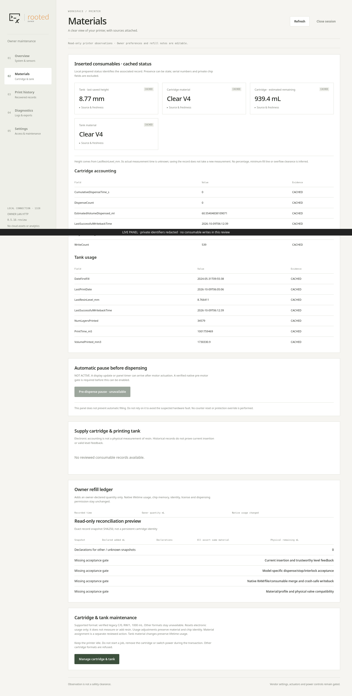
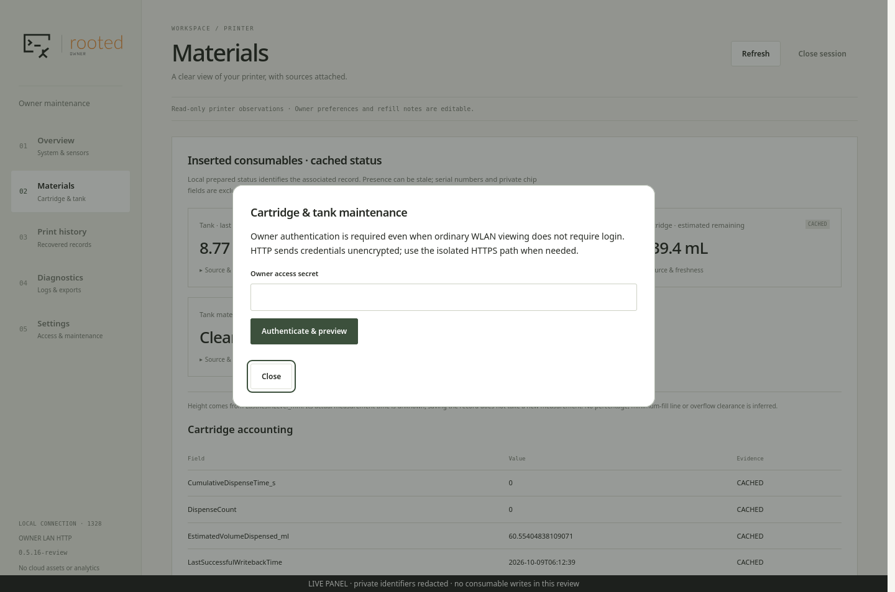
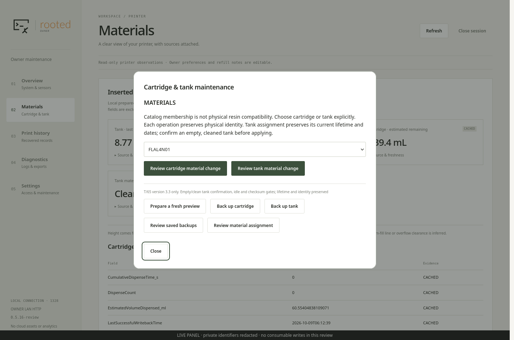
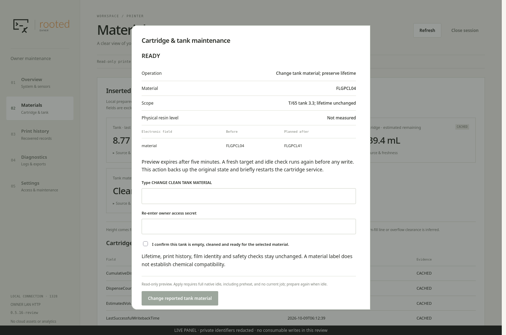
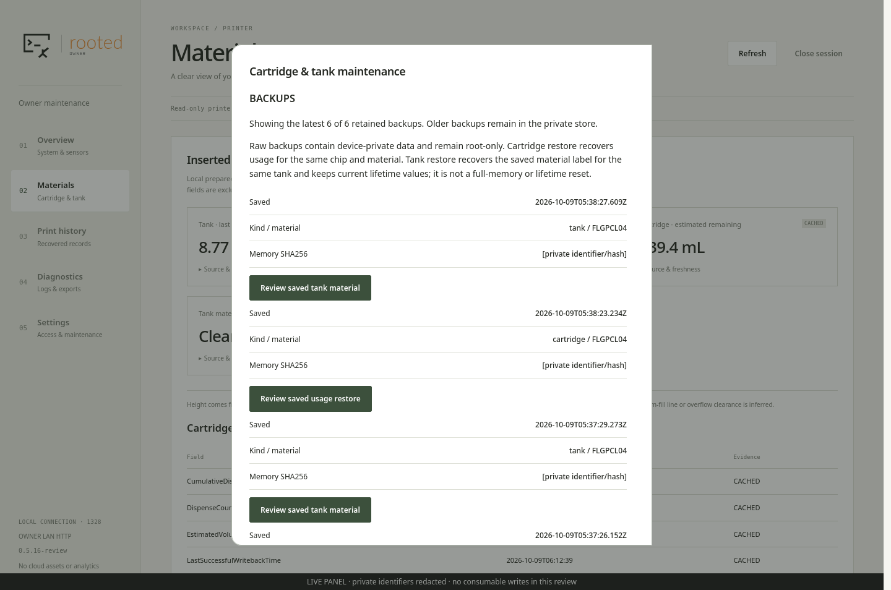
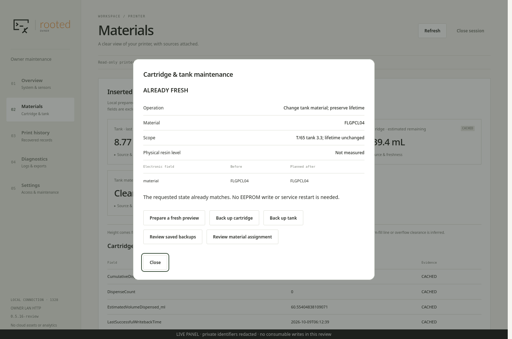

# Tank material editing in the owner panel

The 0.5.16 extension adds **material assignment and saved-material restoration**
for the reference Form 3 tank: T/65, mechanical version 3.3, firmware 2.5.6-2773.
Cartridge usage and material operations remain separate. Other formats are
refused with a reason; this is not an arbitrary EEPROM editor.

## What the operation changes

Only the tank's `LastResinUsed` code and the two associated RW checksums change.
The persistent tank record receives the same material code. ROM identity, RO
memory, keys, manufacturing data, cumulative volume, layers, print time, dates,
last saved level and unknown fields remain unchanged. **No tank lifetime reset
is provided.** A material assignment does not establish resin/film compatibility.

The owner implementation uses a bounded material-only transaction instead of
calling the vendor `TellTankPrinted` accounting operation. The latter updates
accounting/dates and is not a simple material setter. This implementation does
not claim equivalence to every touchscreen reprogramming eligibility rule. It
requires an explicitly public Form 3 catalog entry and the reference tank format;
normal printer compatibility, lifetime and physical interlocks remain enabled.

## Use

1. Open **Materials → Manage cartridge & tank → Review material assignment**.
   The dialog contains both cartridge and tank maintenance.
2. Authenticate, select the intended catalog code, and choose
   **Review tank material change**. Preview alone is read-only, including during preheat. Apply remains disabled
   until a new preview confirms full native idle; every write repeats that check.
3. Check the current and target material. Before applying, the tank must actually
   be empty and cleaned for the intended material. Follow the tank manufacturer's
   handling instructions; a checkbox cannot measure contamination or compatibility.
4. Confirm the empty/clean condition, type **CHANGE CLEAN TANK MATERIAL** and
   re-enter the owner access secret. The backend rechecks a fresh native idle
   state, no current job, target identity, source pins and the exact preview.
5. Keep power connected and do not start a job or remove a consumable. The
   transaction retains a private backup, excludes the native writer, changes the
   file then B then A, compares complete readbacks, restarts only the consumable
   service and checks native material recognition and unchanged accounting.

For a saved tank backup, **Review saved backups → Review saved tank material**
prepares the saved material code using the **current** tank lifetime. It only
accepts a backup of the same physical tank with matching identity, keys and
non-RW memory. It is not a full-memory restore or a way to erase wear history.
If the saved code is no longer an eligible public Form 3 catalog entry, it is
refused. A matching current material produces a no-op without a service restart.

## Failure and recovery

The transaction keeps a durable marker and exact private pre-write memory/mirror
snapshots. On a caught file/page/readback failure it restores attempted A/B
records and the original file, then checks the complete original image. It never
programs protection, secret or identity pages. Unchanged records are not retried
merely because a protected write failed.

A power interruption is not caught by Python. The copies are not an atomic
hardware transaction. The durable marker blocks subsequent panel writes; preserve
it and the backup for review. Do not clear the marker or copy an entire old tank
image to make the UI green. Post-restart disagreement also remains a recovery
case, rather than repeatedly overwriting a competing source. Owner software
rollback does not undo consumable state.

## Evidence and reproducibility

The [tank format](TANK_DATA.md) and earlier native crypto/serialization tests are
separate from this transaction. The kernel module SHA256 is
`2549601cf7b059f1cad752234377d2270f1721c2a7a38b8ef27878c54732950a`.
`eeprom_write` at module `.text+0x169c` was exercised in ARM instruction emulation:
32-byte page splitting, partial-page read/modify/write, bounds and injected
second-page failure. Mutex, memcpy and bus read/write callbacks were synthetic.
No kernel module was loaded, and no hardware bus was available to that test.
The 41-byte A/B records occupy chip pages 1/2 and 4/5 respectively; these numbers
are **tank memory pages, not printer eMMC partitions**.

```bash
# LAPTOP — own copied module; synthetic bus, no printer connection
: "${TANK_DRIVER_COPY:?Set the copied reference module path}"
: "${UNICORN_MODULE_ROOT:?Set the installed unicorn module directory}"
python3 tools/probe_tank_driver.py --module "$TANK_DRIVER_COPY" \
  --unicorn-dir "$UNICORN_MODULE_ROOT" --output build/tank-driver-probe.json
```

[Transaction tests](../../tests/test_tank_transaction.py) cover identity and extent
rejection, file/partial-page/readback errors, rollback, native re-recognition,
backup integrity and cross-endpoint rejection. HTTP tests require login, CSRF,
Origin, reauthentication and the typed tank confirmation. The isolated Firefox
fixture exercises both tank UI flows. Fixture success is not a real tank write
or physical resin compatibility result. Live installation/preview results are
recorded separately; screenshots never require a consumable write.

## Installed reference and original screenshots

The [0.5.16 acceptance receipt](tank_panel_acceptance.json) binds the installed
maintenance package, source commit, fixture results and genuine Python 3.5.3 /
Linux 4.9.65 checks. Direct HTTP and pinned SSH remained available; vendor process
IDs and boot identity did not change. The tank remained FLGPCL04 with identical
EEPROM contents. **A tank EEPROM write was not performed in this review.**

These seven original captures show the installed panel, not a fixture. Private
hostname, addresses, consumable identifiers and hashes were redacted before
capture; PNG metadata was removed. Click images for full resolution. The long
Materials page and backup list scroll in normal use.

### Materials and authentication

Open the maintenance dialog below the tank and cartridge observations. Write
operations require separate authentication even when ordinary viewing is open.





### Catalog and tank preview

The catalog offers separate cartridge and tank actions. This preview selected
FLGPCL41 from current FLGPCL04; **it did not apply that selection**. Native preheat
was active, so the final button accurately required full idle and a fresh preview.
READY means the preview exists, not that the printer is cleared to write.





### Saved material and unchanged state

Backups offer the saved material of the same tank. In this capture the saved and
current material matched. Both restoration and direct material selection therefore
returned ALREADY FRESH without writing or restarting the consumable service. This
label means the requested fields already match; it does not mean the tank is new.





